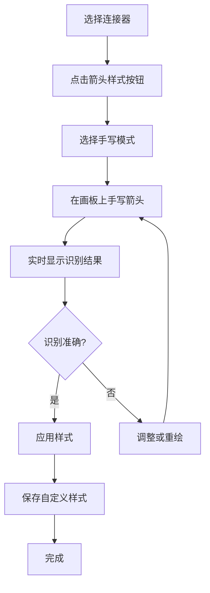

# AFFiNE 手写箭头功能开发计划

## 项目概述

### 功能目标
在 AFFiNE 前端连接器系统中添加手写箭头功能，允许用户通过手写输入创建自定义箭头样式，提升用户创作的自由度和个性化体验。

### 核心特性
- ✨ **手写识别**：智能识别手写笔画为标准箭头样式
- 🎨 **自定义样式**：生成和保存个性化箭头样式  
- 🔄 **实时预览**：边写边预览，即时反馈
- 📚 **样式管理**：本地存储和云端同步自定义样式
- 🎯 **无缝集成**：完全集成到现有连接器工具栏

## 技术架构

### 系统架构图
```
┌─────────────────┐    ┌─────────────────┐    ┌─────────────────┐
│   手写输入层     │───▶│   识别处理层     │───▶│   渲染展示层     │
│                │    │                │    │                │
│ - 触控事件捕获   │    │ - 几何特征提取   │    │ - Canvas渲染    │
│ - 笔画路径记录   │    │ - 模式匹配识别   │    │ - SVG矢量输出   │
│ - 实时预览      │    │ - 自定义样式生成  │    │ - Rough.js集成  │
└─────────────────┘    └─────────────────┘    └─────────────────┘
         │                       │                       │
         └───────────────────────┼───────────────────────┘
                                │
                    ┌─────────────────┐
                    │   存储管理层     │
                    │                │
                    │ - 本地存储      │
                    │ - 样式索引      │
                    │ - 云端同步      │
                    └─────────────────┘
```

### 技术栈选择
- **手写识别**：几何特征分析 + 模板匹配
- **图形处理**：Canvas 2D API + Path2D
- **UI框架**：Lit Element (与现有技术栈一致)
- **样式渲染**：RoughJS (复用现有rough样式系统)
- **存储方案**：LocalStorage + IndexedDB
- **状态管理**：集成现有 BlockSuite 状态系统

## 开发阶段规划

### Phase 1: 基础架构搭建 (Week 1-2)

#### 1.1 核心数据结构设计
**文件位置**: `/blocksuite/affine/model/src/consts/connector.ts`

**任务列表**:
- [ ] 扩展 `PointStyle` 枚举添加手写相关样式
- [ ] 设计 `CustomArrowStyle` 接口
- [ ] 定义 `HandwritingStroke` 数据结构
- [ ] 创建 `ArrowRecognitionResult` 类型

**实现细节**:
```typescript
// 新增样式类型
export enum PointStyle {
  // ... 现有样式
  Custom = 'Custom',
  HandwrittenInput = 'HandwrittenInput',
}

// 自定义箭头样式定义
interface CustomArrowStyle {
  id: string;
  name: string;
  path: Point[];
  boundingBox: BoundingBox;
  style: 'handwritten' | 'smooth';
  createdAt: Date;
  metadata: StyleMetadata;
}
```

#### 1.2 连接器模型扩展
**文件位置**: `/blocksuite/affine/model/src/elements/connector/connector.ts`

**任务列表**:
- [ ] 扩展 `ConnectorElementProps` 接口
- [ ] 添加自定义样式属性支持
- [ ] 实现样式序列化/反序列化
- [ ] 添加向后兼容性处理

**实现细节**:
```typescript
export interface ConnectorElementProps extends ElementProps {
  // ... 现有属性
  customArrowStyles?: {
    front?: CustomArrowStyleRef;
    rear?: CustomArrowStyleRef;
  };
  handwritingSessionData?: HandwritingSessionData;
}
```

### Phase 2: 手写识别引擎 (Week 3-4)

#### 2.1 几何特征提取器
**文件位置**: `/blocksuite/affine/gfx/connector/src/recognition/geometry-analyzer.ts`

**任务列表**:
- [ ] 实现笔画边界框计算
- [ ] 开发角度和曲率分析算法
- [ ] 构建对称性检测机制
- [ ] 设计特征向量生成器

**核心算法**:
```typescript
class GeometryAnalyzer {
  extractFeatures(strokes: Point[][]): GeometricFeatures {
    return {
      boundingBox: this.calculateBoundingBox(strokes),
      angles: this.analyzeAngles(strokes),
      curvature: this.calculateCurvature(strokes),
      symmetry: this.detectSymmetry(strokes),
      aspectRatio: this.getAspectRatio(strokes),
      strokeComplexity: this.measureComplexity(strokes)
    };
  }
}
```

#### 2.2 模式识别器
**文件位置**: `/blocksuite/affine/gfx/connector/src/recognition/pattern-matcher.ts`

**任务列表**:
- [ ] 开发基于规则的分类器
- [ ] 实现模板匹配算法
- [ ] 构建置信度评估系统
- [ ] 设计回退机制

**识别规则**:
```typescript
class PatternMatcher {
  recognizeArrowType(features: GeometricFeatures): RecognitionResult {
    const rules = [
      { type: 'Triangle', matcher: this.isTrianglePattern },
      { type: 'Circle', matcher: this.isCirclePattern },
      { type: 'Diamond', matcher: this.isDiamondPattern },
      { type: 'Arrow', matcher: this.isArrowPattern }
    ];
    
    return this.applyRules(features, rules);
  }
}
```

#### 2.3 路径优化器
**文件位置**: `/blocksuite/affine/gfx/connector/src/recognition/path-optimizer.ts`

**任务列表**:
- [ ] 实现道格拉斯-普克简化算法
- [ ] 开发贝塞尔曲线拟合
- [ ] 构建噪声过滤器
- [ ] 设计路径标准化器

### Phase 3: 手写输入界面 (Week 5-6)

#### 3.1 手写画板组件
**文件位置**: `/blocksuite/affine/gfx/connector/src/components/handwriting-canvas.ts`

**任务列表**:
- [ ] 实现触控事件处理
- [ ] 开发实时笔画渲染
- [ ] 构建多点触控支持
- [ ] 添加压感检测

**组件设计**:
```typescript
@customElement('handwriting-canvas')
export class HandwritingCanvas extends LitElement {
  private strokeRecorder = new StrokeRecorder();
  private realTimeRenderer = new RealTimeRenderer();
  
  @property({ type: Boolean })
  isRecording = false;
  
  render() {
    return html`
      <div class="canvas-container">
        <canvas 
          @pointerdown=${this.startStroke}
          @pointermove=${this.continueStroke}
          @pointerup=${this.endStroke}
        ></canvas>
        <div class="toolbar">
          <button @click=${this.clear}>清除</button>
          <button @click=${this.undo}>撤销</button>
        </div>
      </div>
    `;
  }
}
```

#### 3.2 样式选择面板
**文件位置**: `/blocksuite/affine/gfx/connector/src/components/style-selector.ts`

**任务列表**:
- [ ] 设计识别结果展示界面
- [ ] 实现样式预览功能
- [ ] 开发样式库管理
- [ ] 添加样式搜索过滤

#### 3.3 工具栏集成
**文件位置**: `/blocksuite/affine/gfx/connector/src/toolbar/config.ts`

**任务列表**:
- [ ] 扩展现有工具栏配置
- [ ] 添加手写模式切换按钮
- [ ] 集成样式选择下拉菜单
- [ ] 实现工具提示和帮助

### Phase 4: 渲染系统集成 (Week 7-8)

#### 4.1 自定义箭头渲染器
**文件位置**: `/blocksuite/affine/gfx/connector/src/element-renderer/custom-arrow-renderer.ts`

**任务列表**:
- [ ] 实现自定义路径渲染
- [ ] 集成 RoughJS 手绘效果
- [ ] 开发缓存优化机制
- [ ] 添加渲染性能监控

**渲染实现**:
```typescript
export class CustomArrowRenderer {
  render(
    style: CustomArrowStyle,
    context: CanvasRenderingContext2D,
    options: RenderOptions
  ): void {
    const optimizedPath = this.optimizePath(style.path);
    
    if (options.rough) {
      this.renderWithRoughJS(optimizedPath, context, options);
    } else {
      this.renderSmooth(optimizedPath, context, options);
    }
  }
}
```

#### 4.2 主渲染器更新
**文件位置**: `/blocksuite/affine/gfx/connector/src/element-renderer/index.ts`

**任务列表**:
- [ ] 更新 `renderEndpoint` 函数
- [ ] 添加自定义样式分支处理
- [ ] 实现样式缓存机制
- [ ] 处理渲染异常情况

### Phase 5: 数据持久化 (Week 9-10)

#### 5.1 本地存储管理
**文件位置**: `/blocksuite/affine/gfx/connector/src/storage/local-storage.ts`

**任务列表**:
- [ ] 设计存储架构
- [ ] 实现 CRUD 操作接口
- [ ] 开发数据压缩算法
- [ ] 添加存储配额管理

**存储架构**:
```typescript
class CustomStyleStorage {
  private readonly DB_NAME = 'affine-custom-arrows';
  private readonly VERSION = 1;
  
  async saveStyle(style: CustomArrowStyle): Promise<void> {
    const compressed = await this.compressStyle(style);
    return this.store('styles', compressed);
  }
  
  async loadStyles(): Promise<CustomArrowStyle[]> {
    const compressed = await this.getAll('styles');
    return Promise.all(compressed.map(this.decompressStyle));
  }
}
```

#### 5.2 云端同步机制
**文件位置**: `/blocksuite/affine/gfx/connector/src/storage/sync-manager.ts`

**任务列表**:
- [ ] 设计同步协议
- [ ] 实现冲突解决机制
- [ ] 开发增量同步算法
- [ ] 添加离线支持

### Phase 6: 性能优化与测试 (Week 11-12)

#### 6.1 性能优化
**任务列表**:
- [ ] 识别算法性能调优
- [ ] 渲染管道优化
- [ ] 内存使用优化
- [ ] 异步处理改进

**优化目标**:
- 手写识别响应时间 < 100ms
- 自定义样式渲染帧率 > 60fps
- 内存占用增长 < 10MB
- 样式加载时间 < 50ms

#### 6.2 测试框架
**文件位置**: `/blocksuite/affine/gfx/connector/src/__tests__/`

**任务列表**:
- [ ] 编写单元测试覆盖核心算法
- [ ] 开发集成测试验证端到端流程
- [ ] 构建性能测试基准
- [ ] 实现视觉回归测试

**测试覆盖**:
```typescript
describe('HandwritingRecognition', () => {
  describe('GeometryAnalyzer', () => {
    it('should extract correct features from triangle stroke', () => {
      const triangleStroke = createTriangleStroke();
      const features = analyzer.extractFeatures([triangleStroke]);
      expect(features.angles).toContainAnglesNear([Math.PI/3, Math.PI/3, Math.PI/3]);
    });
  });
  
  describe('PatternMatcher', () => {
    it('should recognize triangle with high confidence', () => {
      const result = matcher.recognize(triangleFeatures);
      expect(result.type).toBe('Triangle');
      expect(result.confidence).toBeGreaterThan(0.8);
    });
  });
});
```

## 用户体验设计

### 交互流程


### UI/UX 规范

#### 视觉设计原则
- **简洁直观**：最小化学习成本，符合用户直觉
- **即时反馈**：实时预览和状态提示
- **错误容忍**：支持撤销重做，降低试错成本
- **一致性**：与现有 AFFiNE 设计语言保持一致

#### 响应式设计
- **桌面端**：鼠标 + 键盘操作优化
- **平板端**：触控笔精确绘制支持
- **移动端**：手指触控友好交互

#### 可访问性
- 支持键盘导航
- 提供语音提示
- 高对比度模式
- 屏幕阅读器兼容

## 技术风险与解决方案

### 主要风险点

#### 1. 识别准确率风险
**风险描述**：手写识别准确率不达预期，影响用户体验

**解决方案**：
- 采用多层识别策略：几何特征 + 模板匹配 + 用户反馈学习
- 建立大量测试数据集验证算法效果
- 提供手动调整和重新识别机制
- 设计置信度阈值，低置信度时提示用户确认

#### 2. 性能影响风险
**风险描述**：复杂的识别算法可能影响应用整体性能

**解决方案**：
- 使用 Web Workers 进行后台计算
- 实现渐进式加载和懒加载
- 优化算法复杂度，使用缓存机制
- 设置性能监控和降级策略

#### 3. 跨平台兼容性
**风险描述**：不同设备和浏览器的触控事件处理差异

**解决方案**：
- 使用标准化的 Pointer Events API
- 建立完善的设备兼容性测试矩阵
- 实现优雅的功能降级
- 提供多种输入方式支持

#### 4. 数据存储限制
**风险描述**：自定义样式数据量过大，超出浏览器存储限制

**解决方案**：
- 实现高效的数据压缩算法
- 设计分层存储策略（本地 + 云端）
- 提供存储清理和优化工具
- 实现样式数据的增量同步

### 质量保障措施

#### 代码质量
- **静态分析**：ESLint + TypeScript 严格类型检查
- **代码审查**：强制 PR Review 流程
- **测试覆盖**：单元测试覆盖率 > 85%
- **文档完整**：API 文档和使用说明齐全

#### 性能监控
- **关键指标**：识别耗时、渲染帧率、内存使用
- **监控工具**：集成 Performance API 监控
- **阈值告警**：性能指标超出预期时自动告警
- **用户反馈**：收集真实用户体验数据

## 项目时间线

### 里程碑计划
| 阶段 | 时间 | 主要交付物 | 验收标准 |
|------|------|------------|----------|
| Phase 1 | Week 1-2 | 基础架构和数据模型 | 类型定义完整，通过编译检查 |
| Phase 2 | Week 3-4 | 手写识别引擎 | 基本图形识别准确率 > 80% |
| Phase 3 | Week 5-6 | 用户界面组件 | UI 组件功能完整，交互流畅 |
| Phase 4 | Week 7-8 | 渲染系统集成 | 自定义箭头正确渲染显示 |
| Phase 5 | Week 9-10 | 数据持久化 | 样式保存加载功能正常 |
| Phase 6 | Week 11-12 | 优化测试发布 | 性能达标，测试覆盖充分 |

### 关键节点
- **Week 4**：识别引擎功能验证
- **Week 8**：端到端功能打通
- **Week 12**：功能正式发布

## 资源需求

### 人力资源
- **前端开发工程师** × 2：负责核心功能开发
- **算法工程师** × 1：负责识别算法优化
- **UI/UX 设计师** × 1：负责交互设计
- **测试工程师** × 1：负责质量保障
- **项目经理** × 1：负责进度协调

### 技术资源
- **开发环境**：现有前端开发工具链
- **测试设备**：多种触控设备（平板、触控笔、手机）
- **性能测试**：性能监控和分析工具
- **云端存储**：样式数据同步服务

## 成功指标

### 功能指标
- ✅ 支持 5+ 种标准箭头自动识别
- ✅ 自定义样式创建和应用
- ✅ 样式数据持久化和同步
- ✅ 跨平台兼容性支持

### 性能指标
- 🎯 手写识别响应时间 < 100ms
- 🎯 识别准确率 > 85%
- 🎯 渲染帧率 > 60fps
- 🎯 功能可用性 > 99.5%

### 用户体验指标
- 📊 功能使用率 > 15%（活跃用户中）
- 📊 用户满意度 > 4.0/5.0
- 📊 功能完成率 > 90%
- 📊 支持请求率 < 2%

## 后续规划

### 短期增强 (3-6个月)
- **机器学习优化**：引入轻量级 ML 模型提升识别准确率
- **批量操作**：支持批量应用自定义样式
- **样式分享**：用户间样式分享和社区功能
- **快捷键支持**：键盘快捷操作提升效率

### 长期愿景 (6-12个月)
- **智能推荐**：基于使用习惯推荐合适样式
- **协作功能**：团队共享自定义样式库
- **API 开放**：为第三方插件提供样式扩展接口
- **移动端优化**：专门的移动端手写体验

### 技术演进
- **WebAssembly**：将复杂算法移植到 WASM 提升性能
- **WebGL 渲染**：利用 GPU 加速复杂样式渲染
- **离线 AI**：本地部署轻量级模型减少网络依赖
- **多模态输入**：支持语音描述转箭头样式

---

## 附录

### A. 相关技术文档
- [BlockSuite 架构文档](https://blocksuite.io)
- [RoughJS 使用指南](https://roughjs.com)
- [Canvas API 参考](https://developer.mozilla.org/en-US/docs/Web/API/Canvas_API)
- [Pointer Events 规范](https://w3c.github.io/pointerevents/)

### B. 设计原型
- [Figma 设计稿链接](#)
- [交互原型演示](#)
- [用户体验地图](#)

### C. 技术调研报告
- [手写识别算法对比分析](#)
- [性能基准测试报告](#)
- [竞品功能分析](#)

---

**文档版本**：v1.0  
**最后更新**：2024-07-24  
**负责人**：前端开发团队  
**审核人**：技术架构师