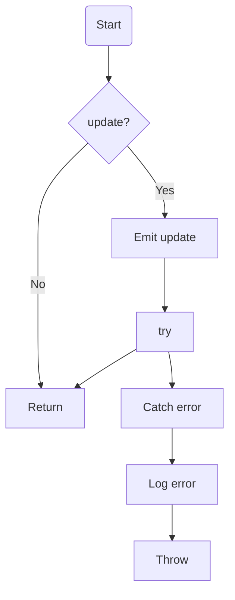
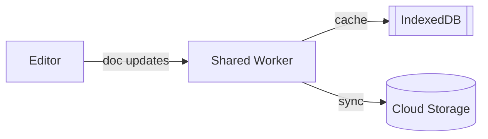

# 代码/DSL 样例库

## 1. 代码解析示例
### 1.1 文档同步（基础控制流）
```ts
export async function pushDocUpdate(update) {
  if (!update) {
    return;
  }
  try {
    await socket.emitWithAck('space:push-doc-update', update);
  } catch (error) {
    logError(error);
    throw error;
  }
}
```
- 节点：`Start` → `Check update` → `Emit` → `Success` / `Catch` → `Log` → `Throw`。
- 渲染建议：`if` → 菱形，`try` → 分支，`await` 标记为异步节点。

### 1.2 Worker 初始化（循环 + 异步）
```ts
export async function initWorkers(peers) {
  for (const peer of peers) {
    const worker = await createWorker(peer);
    connections.set(peer.id, worker);
  }
  return connections;
}
```
- 节点：`Start` → `Loop peers` → `Await createWorker` → `Set connection` → `Loop End` → `Return`。
- 循环边设置回环箭头，并在图中标注 `for`。

## 2. DSL 示例
### 2.1 白板同步拓扑
```plain
diagram "Realtime Sync" {
  theme course
  node app type browser label "Editor"
  node worker type worker label "Shared Worker"
  group storage label "Storage" {
    node cache type database label "IndexedDB"
    node cloud type service label "Cloud Storage"
  }

  app -> worker : "doc updates"
  worker -> storage.cache : cache
  worker -> storage.cloud when online : sync
}
```

### 2.2 组件化示例
```plain
component CloudSync(space) {
  group ${space}.storage label "${space} Storage" {
    node ${space}.cache type database label "${space} Cache"
    node ${space}.cloud type service label "${space} Cloud"
  }
  ${space}.cache -> ${space}.cloud when online
}

diagram "Workspace Sync" {
  use CloudSync("workspace")
  node editor type browser label "Editor"
  editor -> workspace.cache
}
```

### 2.3 Swimlane 布局
```plain
diagram "Deployment" {
  layout swimlane client server storage

  node mobile type client label "Mobile"
  node api type service label "API Gateway" data { "lane": "server" }
  node db type database label "DB" data { "lane": "storage" }

  mobile -> api
  api => db
}
```

## 3. Mermaid 导出对应
- 代码 1.1 输出：

- DSL 2.1 输出：


## 4. 测试样例清单
| 编号 | 类型 | 描述 |
| --- | --- | --- |
| C01 | 代码 | 简单 if/return |
| C02 | 代码 | try/catch/finally |
| C03 | 代码 | for + await |
| C04 | 代码 | switch 多 case |
| C05 | 代码 | 嵌套 if/loop |
| D01 | DSL | 基础 diagram + node + edge |
| D02 | DSL | group 嵌套 |
| D03 | DSL | component + use 参数化 |
| D04 | DSL | layout 指示 |
| D05 | DSL | when 条件、style 组合 |

## 5. 未来扩展案例
- 代码：Promise.all、生成器函数、Redux saga。
- DSL：微服务架构（多 region）、CI/CD pipeline、消息队列拓扑。

