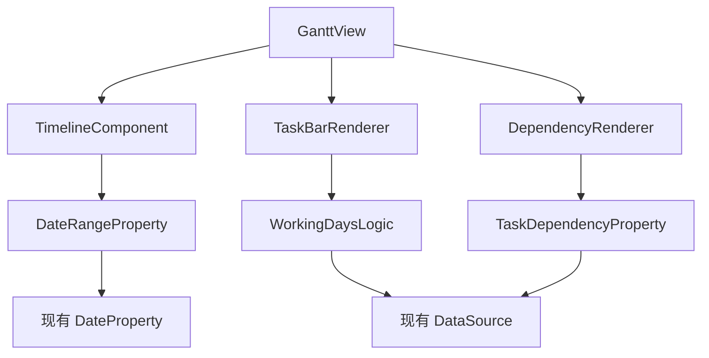

# 甘特图增强功能开发文档

## 📋 项目概述

**功能名称**: 甘特图时间线视图增强  
**项目类型**: 数据视图系统扩展  
**优先级**: 高  
**预估工时**: 4-6 个工作日  
**负责模块**: 数据视图系统 (data-view)  

---

## 🎯 功能目标

### 核心需求
基于现有的甘特图模板，开发动态的甘特图数据视图，支持：
- **非连续工作日可视化**: 任务条仅在实际工作日显示实心，其他时间用虚线连接
- **任务依赖关系**: 可视化任务间的依赖关系
- **实时数据绑定**: 与数据源同步，支持动态更新
- **交互式编辑**: 拖拽调整任务时间和工作日

### 业务价值
- 更精确的项目时间管理
- 清晰的资源分配可视化
- 提升并行任务管理效率
- 增强团队协作透明度

---

## 🏗️ 技术架构

### 基于现有系统扩展

#### 1. 数据视图系统扩展
```
packages/frontend/core/src/blocksuite/yunke/data-view/
├── view-presets/
│   ├── table/          # 现有表格视图
│   ├── kanban/         # 现有看板视图
│   └── gantt/          # 新增甘特图视图 ⭐
├── property-presets/
│   ├── date/           # 现有日期属性
│   ├── date-range/     # 新增日期范围属性 ⭐
│   └── task-dependency/ # 新增依赖属性 ⭐
└── common/
    └── timeline/       # 新增时间轴组件 ⭐
```

#### 2. 模块依赖关系


---

## 📊 数据模型设计

### 1. 甘特图视图类型定义

```typescript
// gantt/define.ts
export const ganttViewType = viewType('gantt');

export type GanttViewData = BasicViewDataType<'gantt', {
  // 时间轴配置
  timeline: {
    startDate: number;        // Unix 时间戳
    endDate: number;          // Unix 时间戳
    unit: 'day' | 'week' | 'month';
    showWeekends: boolean;
    workingDays: number[];    // [1,2,3,4,5] 代表周一到周五
  };
  
  // 甘特图专用列配置
  columns: GanttViewColumn[];
  
  // 任务依赖关系
  dependencies: TaskDependency[];
  
  // 显示选项
  display: {
    showCriticalPath: boolean;
    showProgress: boolean;
    compactMode: boolean;
  };
}>;

export type GanttViewColumn = ViewColumn & {
  type: 'task-name' | 'start-date' | 'end-date' | 'duration' | 'progress' | 'assignee';
  ganttConfig?: {
    width?: number;
    color?: string;
    pattern?: 'solid' | 'striped' | 'dotted';
  };
};

export type TaskDependency = {
  id: string;
  fromTaskId: string;
  toTaskId: string;
  type: 'finish-to-start' | 'start-to-start' | 'finish-to-finish' | 'start-to-finish';
  lag?: number; // 延迟天数
};
```

### 2. 日期范围属性扩展

```typescript
// property-presets/date-range/define.ts
export const dateRangePropertyType = propertyType('date-range');

export type DateRangePropertyData = {
  startDate: number | null;
  endDate: number | null;
  workingDays?: number[]; // 工作日数组，null 表示连续
  timezone?: string;
};

export const dateRangePropertyModelConfig = dateRangePropertyType.modelConfig<
  DateRangePropertyData,
  DateRangePropertyData,
  string
>({
  name: '日期范围',
  defaultData: () => ({
    startDate: null,
    endDate: null,
    workingDays: [1, 2, 3, 4, 5], // 默认工作日
  }),
  
  cellRenderer: {
    view: dateRangeCell,
    edit: dateRangeEditor,
  },
  
  cellValue: {
    jsonValue: zod.object({
      startDate: zod.number().nullable(),
      endDate: zod.number().nullable(),
      workingDays: zod.array(zod.number()).optional(),
    }),
    
    rawValue: {
      toString: ({ value }) => {
        if (!value.startDate || !value.endDate) return '';
        return `${format(value.startDate, 'yyyy-MM-dd')} ~ ${format(value.endDate, 'yyyy-MM-dd')}`;
      },
      
      fromString: ({ value }) => {
        const [start, end] = value.split(' ~ ');
        return {
          startDate: start ? parse(start, 'yyyy-MM-dd', new Date()).getTime() : null,
          endDate: end ? parse(end, 'yyyy-MM-dd', new Date()).getTime() : null,
        };
      },
    },
  },
});
```

### 3. 任务依赖属性

```typescript
// property-presets/task-dependency/define.ts
export const taskDependencyPropertyType = propertyType('task-dependency');

export type TaskDependencyData = {
  dependencies: string[]; // 依赖的任务ID数组
  dependencyType: 'finish-to-start' | 'start-to-start';
  lag: number; // 延迟天数
};
```

---

## 🎨 UI/UX 设计规范

### 1. 甘特图视图布局

```
┌─────────────────────────────────────────────────────────────────┐
│ 📊 甘特图                                    [今天] [+] [⚙️]    │
├─────────────────────────────────────────────────────────────────┤
│ 任务名称     │ 开始日期   │ 结束日期   │ 2025-01 │ 2025-02 ... │
├─────────────────────────────────────────────────────────────────┤
│ 项目设计     │ 01-15     │ 01-25     │ [██]--[█] │             │
│ 前端开发     │ 01-20     │ 02-10     │      [██] │ [██]--[█]   │
│ 后端开发     │ 01-22     │ 02-05     │       [█] │ [██]        │
│ 测试验收     │ 02-06     │ 02-15     │           │  [██]--[█]  │
└─────────────────────────────────────────────────────────────────┘

说明：
[██] = 实际工作日（实心条）
[--] = 非工作日连接（虚线）
[█]  = 部分工作日
```

### 2. 任务条视觉设计

#### 工作日高亮模式
- **实心条**: 实际工作日，使用任务颜色
- **虚线连接**: 非工作日，使用 30% 透明度
- **周末标识**: 灰色背景区分
- **依赖箭头**: 带箭头的连接线

#### 样式变量

```css
:root {
  /* 甘特图专用变量 */
  --gantt-bar-height: 24px;
  --gantt-bar-radius: 4px;
  --gantt-bar-margin: 2px;
  
  /* 工作日样式 */
  --gantt-working-day: var(--yunke-primary-color);
  --gantt-non-working-day: var(--yunke-border-color);
  --gantt-weekend-bg: var(--yunke-background-secondary-color);
  
  /* 依赖关系 */
  --gantt-dependency-color: var(--yunke-text-secondary-color);
  --gantt-dependency-width: 2px;
}
```

---

## 🛠️ 开发实现计划

### 阶段 1: 基础架构 (2 天)

#### 1.1 创建甘特图视图类型

```typescript
// packages/frontend/core/src/blocksuite/yunke/data-view/view-presets/gantt/define.ts
export const ganttViewModel = ganttViewType.createModel<GanttViewData>({
  defaultName: '甘特图',
  dataViewManager: GanttSingleView,
  defaultData: viewManager => ({
    timeline: {
      startDate: Date.now(),
      endDate: Date.now() + 30 * 24 * 60 * 60 * 1000, // 30天后
      unit: 'day',
      showWeekends: true,
      workingDays: [1, 2, 3, 4, 5],
    },
    columns: [
      viewManager.propertyMetas[0].id, // 任务名称
    ],
    dependencies: [],
    display: {
      showCriticalPath: false,
      showProgress: true,
      compactMode: false,
    },
  }),
});
```

#### 1.2 甘特图管理器

```typescript
// gantt/gantt-single-view.ts
export class GanttSingleView extends DataViewSingleViewBase<GanttViewData> {
  type = ganttViewType.type;
  
  constructor(viewManager: DataViewManager) {
    super(viewManager);
  }
  
  override get dataConfig(): GanttViewDataConfig {
    return ganttViewDataConfig;
  }
  
  // 甘特图特有的方法
  addDependency(from: string, to: string, type: DependencyType) {
    const dependencies = [...this.view.dependencies];
    dependencies.push({
      id: generateId(),
      fromTaskId: from,
      toTaskId: to,
      type,
    });
    
    this.updateView(view => ({
      ...view,
      dependencies,
    }));
  }
  
  updateTaskSchedule(taskId: string, startDate: number, endDate: number, workingDays?: number[]) {
    // 更新任务时间安排
    const property = this.propertyMetaList.find(p => p.type === 'date-range');
    if (property) {
      this.dataViewManager.rowUpdate(taskId, {
        [property.id]: {
          startDate,
          endDate,
          workingDays,
        },
      });
    }
  }
}
```

### 阶段 2: 时间轴组件 (1 天)

#### 2.1 时间轴头部组件

```typescript
// common/timeline/timeline-header.ts
export class TimelineHeader extends WidgetElement {
  static override styles = css`
    .timeline-header {
      display: flex;
      border-bottom: 1px solid var(--yunke-border-color);
      background: var(--yunke-background-primary-color);
    }
    
    .time-unit {
      min-width: 60px;
      padding: 8px 4px;
      text-align: center;
      border-right: 1px solid var(--yunke-border-color);
      font-size: 12px;
    }
    
    .time-unit.weekend {
      background: var(--gantt-weekend-bg);
    }
  `;
  
  @property({ attribute: false })
  accessor timeline!: GanttViewData['timeline'];
  
  protected override render() {
    const timeUnits = this.generateTimeUnits();
    
    return html`
      <div class="timeline-header">
        ${timeUnits.map(unit => html`
          <div class="time-unit ${unit.isWeekend ? 'weekend' : ''}" 
               style="width: ${unit.width}px">
            ${unit.label}
          </div>
        `)}
      </div>
    `;
  }
  
  private generateTimeUnits() {
    const { startDate, endDate, unit } = this.timeline;
    const units: TimeUnit[] = [];
    
    let current = new Date(startDate);
    const end = new Date(endDate);
    
    while (current <= end) {
      units.push({
        date: new Date(current),
        label: this.formatUnit(current, unit),
        width: this.getUnitWidth(unit),
        isWeekend: this.isWeekend(current),
      });
      
      // 根据 unit 增加时间
      switch (unit) {
        case 'day':
          current.setDate(current.getDate() + 1);
          break;
        case 'week':
          current.setDate(current.getDate() + 7);
          break;
        case 'month':
          current.setMonth(current.getMonth() + 1);
          break;
      }
    }
    
    return units;
  }
  
  private isWeekend(date: Date): boolean {
    const day = date.getDay();
    return day === 0 || day === 6; // 周日或周六
  }
}
```

#### 2.2 任务条渲染器

```typescript
// gantt/components/task-bar.ts
export class TaskBar extends WidgetElement {
  static override styles = css`
    .task-bar-container {
      position: relative;
      height: var(--gantt-bar-height);
      margin: var(--gantt-bar-margin) 0;
    }
    
    .task-segment {
      position: absolute;
      height: 100%;
      border-radius: var(--gantt-bar-radius);
      top: 0;
      display: flex;
      align-items: center;
      justify-content: center;
      font-size: 11px;
      font-weight: 500;
      color: white;
    }
    
    .task-segment.working-day {
      background: var(--gantt-working-day);
      opacity: 1;
    }
    
    .task-segment.non-working-day {
      background: var(--gantt-non-working-day);
      opacity: 0.3;
      border: 1px dashed var(--gantt-working-day);
      border-radius: 0;
      height: 2px;
      top: 50%;
      transform: translateY(-50%);
    }
    
    .task-segment:hover {
      opacity: 0.8;
      cursor: pointer;
    }
    
    .task-segment.selected {
      box-shadow: 0 0 0 2px var(--yunke-primary-color);
    }
  `;
  
  @property({ attribute: false })
  accessor task!: GanttTask;
  
  @property({ attribute: false })
  accessor timeline!: GanttViewData['timeline'];
  
  protected override render() {
    const segments = this.generateTaskSegments();
    
    return html`
      <div class="task-bar-container">
        ${segments.map(segment => html`
          <div 
            class="task-segment ${segment.isWorkingDay ? 'working-day' : 'non-working-day'}"
            style="left: ${segment.left}px; width: ${segment.width}px; background-color: ${this.task.color};"
            @click=${() => this.onSegmentClick(segment)}
            @dragstart=${(e: DragEvent) => this.onDragStart(e, segment)}
            draggable="true"
          >
            ${segment.isWorkingDay ? segment.label : ''}
          </div>
        `)}
      </div>
    `;
  }
  
  private generateTaskSegments(): TaskSegment[] {
    const { startDate, endDate, workingDays } = this.task;
    const segments: TaskSegment[] = [];
    
    if (!workingDays || workingDays.length === 0) {
      // 传统连续模式
      return [{
        startDate,
        endDate,
        isWorkingDay: true,
        left: this.dateToPosition(startDate),
        width: this.dateToPosition(endDate) - this.dateToPosition(startDate),
        label: this.task.name,
      }];
    }
    
    // 非连续工作日模式
    let current = new Date(startDate);
    const end = new Date(endDate);
    
    while (current <= end) {
      const dayOfWeek = current.getDay();
      const isWorkingDay = workingDays.includes(dayOfWeek);
      
      if (isWorkingDay) {
        // 查找连续的工作日段
        const segmentStart = new Date(current);
        while (current <= end && workingDays.includes(current.getDay())) {
          current.setDate(current.getDate() + 1);
        }
        const segmentEnd = new Date(current);
        segmentEnd.setDate(segmentEnd.getDate() - 1);
        
        segments.push({
          startDate: segmentStart.getTime(),
          endDate: segmentEnd.getTime(),
          isWorkingDay: true,
          left: this.dateToPosition(segmentStart.getTime()),
          width: this.dateToPosition(segmentEnd.getTime()) - this.dateToPosition(segmentStart.getTime()) + this.getDayWidth(),
          label: segments.length === 0 ? this.task.name : '',
        });
      } else {
        // 非工作日，创建连接线
        const nonWorkingStart = new Date(current);
        while (current <= end && !workingDays.includes(current.getDay())) {
          current.setDate(current.getDate() + 1);
        }
        const nonWorkingEnd = new Date(current);
        nonWorkingEnd.setDate(nonWorkingEnd.getDate() - 1);
        
        if (segments.length > 0) { // 只有在有前续工作日时才显示连接线
          segments.push({
            startDate: nonWorkingStart.getTime(),
            endDate: nonWorkingEnd.getTime(),
            isWorkingDay: false,
            left: this.dateToPosition(nonWorkingStart.getTime()),
            width: this.dateToPosition(nonWorkingEnd.getTime()) - this.dateToPosition(nonWorkingStart.getTime()) + this.getDayWidth(),
            label: '',
          });
        }
      }
    }
    
    return segments;
  }
}
```

### 阶段 3: 交互功能 (2 天)

#### 3.1 拖拽调整功能

```typescript
// gantt/interactions/drag-handler.ts
export class GanttDragHandler {
  constructor(private ganttView: GanttSingleView) {}
  
  handleTaskDrag(taskId: string, dragEvent: DragEvent) {
    const startX = dragEvent.clientX;
    const startDate = this.getTaskStartDate(taskId);
    
    const onMouseMove = (e: MouseEvent) => {
      const deltaX = e.clientX - startX;
      const deltaDays = Math.round(deltaX / this.getDayWidth());
      const newStartDate = addDays(startDate, deltaDays);
      
      // 实时预览
      this.showPreview(taskId, newStartDate);
    };
    
    const onMouseUp = (e: MouseEvent) => {
      const deltaX = e.clientX - startX;
      const deltaDays = Math.round(deltaX / this.getDayWidth());
      const newStartDate = addDays(startDate, deltaDays);
      
      // 应用更改
      this.ganttView.updateTaskSchedule(taskId, newStartDate.getTime(), ...);
      this.hidePreview();
      
      document.removeEventListener('mousemove', onMouseMove);
      document.removeEventListener('mouseup', onMouseUp);
    };
    
    document.addEventListener('mousemove', onMouseMove);
    document.addEventListener('mouseup', onMouseUp);
  }
}
```

#### 3.2 工作日编辑器

```typescript
// gantt/components/working-days-editor.ts
export class WorkingDaysEditor extends WidgetElement {
  static override styles = css`
    .working-days-editor {
      display: flex;
      gap: 4px;
      align-items: center;
    }
    
    .day-toggle {
      width: 32px;
      height: 24px;
      border: 1px solid var(--yunke-border-color);
      border-radius: 4px;
      background: var(--yunke-background-primary-color);
      font-size: 12px;
      cursor: pointer;
      display: flex;
      align-items: center;
      justify-content: center;
    }
    
    .day-toggle.active {
      background: var(--yunke-primary-color);
      color: white;
      border-color: var(--yunke-primary-color);
    }
    
    .day-toggle:hover {
      border-color: var(--yunke-primary-color);
    }
  `;
  
  @property({ attribute: false })
  accessor workingDays: number[] = [1, 2, 3, 4, 5];
  
  @property({ attribute: false })
  accessor onChange!: (days: number[]) => void;
  
  private readonly dayLabels = ['日', '一', '二', '三', '四', '五', '六'];
  
  protected override render() {
    return html`
      <div class="working-days-editor">
        <span>工作日:</span>
        ${this.dayLabels.map((label, index) => html`
          <button 
            class="day-toggle ${this.workingDays.includes(index) ? 'active' : ''}"
            title="${this.getDayName(index)}"
            @click=${() => this.toggleDay(index)}
          >
            ${label}
          </button>
        `)}
      </div>
    `;
  }
  
  private toggleDay(dayIndex: number) {
    const newWorkingDays = this.workingDays.includes(dayIndex)
      ? this.workingDays.filter(d => d !== dayIndex)
      : [...this.workingDays, dayIndex].sort((a, b) => a - b);
    
    this.onChange(newWorkingDays);
  }
}
```

### 阶段 4: 集成测试 (1 天)

#### 测试用例覆盖
- [ ] **单元测试**: 各组件独立功能
- [ ] **集成测试**: 与数据源的交互
- [ ] **UI 测试**: 响应式布局和交互
- [ ] **性能测试**: 大量任务时的渲染性能

---

## 📚 开发规范

### 1. 代码组织规范

```
gantt/
├── define.ts              # 视图类型定义
├── index.ts              # 统一导出
├── gantt-single-view.ts  # 视图管理器
├── components/           # UI 组件
│   ├── task-bar.ts
│   ├── timeline-header.ts
│   ├── dependency-arrow.ts
│   └── working-days-editor.ts
├── interactions/         # 交互处理
│   ├── drag-handler.ts
│   └── selection-handler.ts
├── utils/               # 工具函数
│   ├── date-calculations.ts
│   └── layout-engine.ts
└── styles/              # 样式定义
    └── gantt.css
```

### 2. 命名规范

#### TypeScript 类型
- **视图数据**: `GanttViewData`
- **组件属性**: `GanttTaskBarProps`
- **事件类型**: `TaskScheduleChangeEvent`
- **工具类**: `DateCalculationUtils`

#### CSS 类名
- **BEM 命名**: `.gantt-view__task-bar--working-day`
- **状态类**: `--active`, `--selected`, `--disabled`
- **尺寸类**: `--compact`, `--normal`, `--expanded`

#### 文件命名
- **组件文件**: `kebab-case.ts`
- **类型文件**: `define.ts`, `types.ts`
- **工具文件**: `utils.ts`, `helpers.ts`

### 3. 错误处理

```typescript
// 统一错误处理
export class GanttViewError extends Error {
  constructor(
    message: string,
    public readonly code: string,
    public readonly context?: Record<string, unknown>
  ) {
    super(message);
    this.name = 'GanttViewError';
  }
}

// 错误类型
export const GANTT_ERROR_CODES = {
  INVALID_DATE_RANGE: 'INVALID_DATE_RANGE',
  CIRCULAR_DEPENDENCY: 'CIRCULAR_DEPENDENCY',
  INVALID_WORKING_DAYS: 'INVALID_WORKING_DAYS',
} as const;
```

### 4. 国际化支持

```typescript
// i18n/gantt.ts
export const ganttI18n = {
  'zh-CN': {
    'gantt.view.title': '甘特图',
    'gantt.task.name': '任务名称',
    'gantt.task.start-date': '开始日期',
    'gantt.task.end-date': '结束日期',
    'gantt.task.duration': '持续时间',
    'gantt.working-days': '工作日',
    'gantt.dependency.add': '添加依赖',
  },
  'en': {
    'gantt.view.title': 'Gantt Chart',
    'gantt.task.name': 'Task Name',
    'gantt.task.start-date': 'Start Date',
    'gantt.task.end-date': 'End Date',
    'gantt.task.duration': 'Duration',
    'gantt.working-days': 'Working Days',
    'gantt.dependency.add': 'Add Dependency',
  },
};
```

---

## ✅ 验收标准

### 功能验收
- [ ] 支持非连续工作日可视化
- [ ] 任务拖拽调整时间
- [ ] 工作日自定义编辑
- [ ] 任务依赖关系显示
- [ ] 与现有数据源集成
- [ ] 响应式布局适配
- [ ] 键盘导航支持

### 性能验收
- [ ] 1000+ 任务渲染 < 1s
- [ ] 拖拽操作延迟 < 100ms
- [ ] 内存占用合理 (< 50MB)
- [ ] 支持无限滚动

### 兼容性验收
- [ ] 现有甘特图模板导入
- [ ] 数据导出到 Excel/PDF
- [ ] 多浏览器兼容性
- [ ] 移动端基础支持

---

**文档版本**: v1.0  
**创建时间**: 2025-01-25  
**维护者**: 开发团队  
**状态**: 待开发