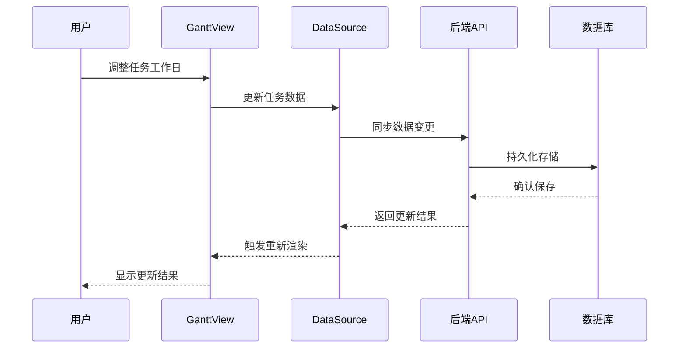
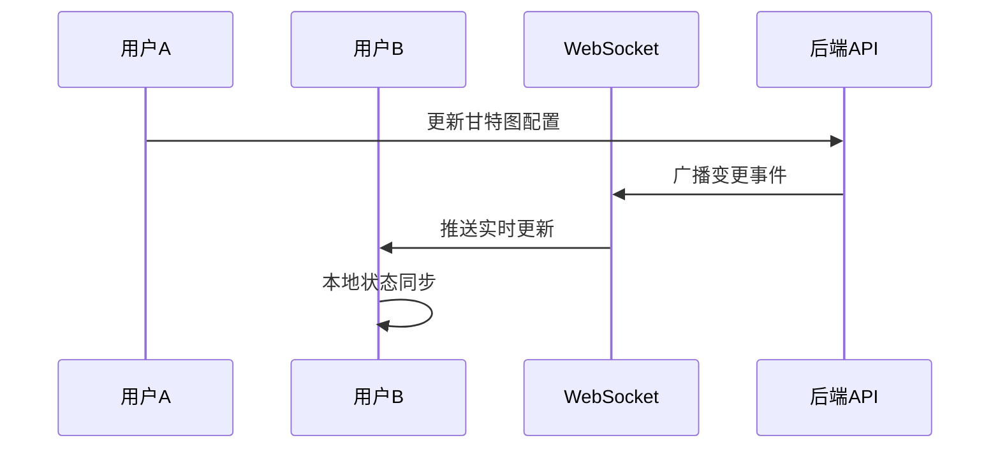

# 甘特图增强功能 - 开发分工与接口文档

## 🎯 开发分工总览

### 核心发现
经过代码分析，YUNKE 采用**前端为主的架构**：
- **数据存储**: 基于 Y.js CRDT 的本地存储 + 云端同步
- **协作机制**: 通过 NBStore 和 WebSocket 实现实时协作  
- **数据持久化**: 前端 IndexedDB + 后端 PostgreSQL
- **架构模式**: 模块化依赖注入 + BlockSuite 编辑器扩展

---

## 📋 三个并行开发任务

### 💻 前端开发任务 (主要开发工作)

**负责人**: 前端开发团队  
**开发周期**: 4-5周  
**技术栈**: TypeScript + Web Components + BlockSuite  

#### 核心开发模块

**1. 甘特图数据视图扩展**
```
packages/frontend/core/src/blocksuite/yunke/data-view/view-presets/gantt/
├── define.ts                    # 甘特图视图类型定义
├── gantt-single-view.ts        # 甘特图视图管理器
├── gantt-view.ts               # 甘特图UI逻辑
├── components/
│   ├── gantt-timeline.ts       # 时间轴组件
│   ├── gantt-task-bar.ts       # 任务条组件  
│   ├── working-day-segment.ts  # 工作日段组件 ⭐核心功能
│   └── dependency-arrow.ts     # 依赖箭头组件
├── interactions/
│   ├── drag-handler.ts         # 拖拽交互处理
│   └── selection-handler.ts    # 选择交互处理
└── utils/
    ├── date-calculations.ts    # 日期计算工具
    └── layout-engine.ts        # 布局引擎
```

**2. 日期范围属性扩展**
```
packages/frontend/core/src/blocksuite/yunke/data-view/property-presets/date-range/
├── define.ts                   # 日期范围属性定义
├── cell-renderer.ts           # 单元格渲染器
├── editor.ts                  # 日期范围编辑器
└── working-days-editor.ts     # 工作日编辑器 ⭐核心功能
```

**3. BlockSuite 编辑器集成**
```
blocksuite/yunke/blocks/gantt-block/
├── gantt-block.ts             # 甘特图块定义
├── gantt-model.ts             # 数据模型
└── gantt-spec.ts              # 块规格定义
```

#### 主要开发任务
- [ ] **非连续工作日可视化** (核心需求)
- [ ] **任务拖拽调整时间**
- [ ] **工作日自定义编辑**  
- [ ] **任务依赖关系显示**
- [ ] **与现有数据源集成**
- [ ] **响应式布局适配**

---

### 🔧 后端开发任务 (支持功能)

**负责人**: 后端开发团队  
**开发周期**: 2-3周  
**技术栈**: Java + Spring Boot + PostgreSQL  

#### 主要开发内容

**1. 数据库扩展设计**
- 扩展现有 `workspace_pages` 表支持甘特图数据
- 创建甘特图配置存储表
- 设计高效的查询索引

**2. API 接口开发**
- 甘特图数据同步接口
- 协作状态管理接口  
- 导出功能接口

**3. 实时协作支持**
- WebSocket 事件广播优化
- 甘特图专用协作处理器

#### 主要开发任务
- [ ] **甘特图数据存储扩展**
- [ ] **实时协作事件处理**
- [ ] **数据导出API接口**
- [ ] **性能监控和优化**

---

### 📊 数据库开发任务 (结构设计)

**负责人**: 数据库团队  
**开发周期**: 1-2周  

#### 主要开发内容

**1. 数据表设计**
```sql
-- 甘特图视图配置表
CREATE TABLE gantt_view_configs (
    id VARCHAR(36) PRIMARY KEY,
    page_id VARCHAR(36) NOT NULL,
    workspace_id VARCHAR(36) NOT NULL,
    timeline_config JSONB NOT NULL,        -- 时间轴配置
    display_config JSONB NOT NULL,         -- 显示配置
    working_calendar JSONB,                -- 工作日历配置
    created_at TIMESTAMP DEFAULT NOW(),
    updated_at TIMESTAMP DEFAULT NOW(),
    FOREIGN KEY (page_id) REFERENCES workspace_pages(page_id),
    FOREIGN KEY (workspace_id) REFERENCES workspaces(id)
);

-- 任务依赖关系表 (如果需要持久化)
CREATE TABLE gantt_task_dependencies (
    id BIGSERIAL PRIMARY KEY,
    page_id VARCHAR(36) NOT NULL,
    from_task_id VARCHAR(36) NOT NULL,
    to_task_id VARCHAR(36) NOT NULL,
    dependency_type VARCHAR(20) DEFAULT 'finish-to-start',
    lag_days INTEGER DEFAULT 0,
    created_at TIMESTAMP DEFAULT NOW(),
    FOREIGN KEY (page_id) REFERENCES workspace_pages(page_id)
);
```

**2. 索引优化**
```sql
-- 甘特图查询优化索引
CREATE INDEX idx_gantt_configs_page ON gantt_view_configs(page_id);
CREATE INDEX idx_gantt_configs_workspace ON gantt_view_configs(workspace_id);
CREATE INDEX idx_gantt_dependencies_page ON gantt_task_dependencies(page_id);
CREATE INDEX idx_gantt_dependencies_from_task ON gantt_task_dependencies(from_task_id);
CREATE INDEX idx_gantt_dependencies_to_task ON gantt_task_dependencies(to_task_id);
```

#### 主要开发任务
- [ ] **甘特图配置存储设计**
- [ ] **数据库性能优化**
- [ ] **数据迁移脚本编写**
- [ ] **备份恢复方案设计**

---

## 📡 接口文档规范

### 前端 ↔ 数据层接口

#### 1. 甘特图视图数据接口
```typescript
// 甘特图视图数据结构
interface GanttViewData {
  timeline: {
    startDate: number;      // Unix 时间戳
    endDate: number;        // Unix 时间戳
    unit: 'day' | 'week' | 'month';
    showWeekends: boolean;
    workingDays: number[];  // [1,2,3,4,5] 周一到周五
  };
  columns: string[];        // 列ID数组
  dependencies: TaskDependency[];
  display: {
    showCriticalPath: boolean;
    showProgress: boolean;
    compactMode: boolean;
  };
}

// 任务依赖关系
interface TaskDependency {
  id: string;
  fromTaskId: string;
  toTaskId: string;
  type: 'finish-to-start' | 'start-to-start' | 'finish-to-finish' | 'start-to-finish';
  lag: number;
}
```

#### 2. 日期范围属性接口
```typescript
// 日期范围属性数据
interface DateRangePropertyData {
  startDate: number | null;
  endDate: number | null;
  workingDays?: number[];   // 核心功能：非连续工作日
  timezone?: string;
}

// 工作日编辑器接口
interface WorkingDaysEditor {
  workingDays: number[];
  onChange: (days: number[]) => void;
  readonly holidays?: Date[];
  readonly specialWorkingDays?: Date[];
}
```

### 前端 ↔ 后端接口

#### 1. 甘特图配置管理
```typescript
// GET /api/workspaces/{workspaceId}/pages/{pageId}/gantt-config
interface GetGanttConfigResponse {
  success: boolean;
  data: {
    id: string;
    pageId: string;
    timelineConfig: GanttViewData['timeline'];
    displayConfig: GanttViewData['display'];
    workingCalendar?: WorkingCalendar;
    createdAt: string;
    updatedAt: string;
  };
}

// PUT /api/workspaces/{workspaceId}/pages/{pageId}/gantt-config
interface UpdateGanttConfigRequest {
  timelineConfig?: Partial<GanttViewData['timeline']>;
  displayConfig?: Partial<GanttViewData['display']>;
  workingCalendar?: WorkingCalendar;
}
```

#### 2. 依赖关系管理
```typescript
// POST /api/workspaces/{workspaceId}/pages/{pageId}/task-dependencies
interface CreateDependencyRequest {
  fromTaskId: string;
  toTaskId: string;
  type: TaskDependency['type'];
  lag?: number;
}

// GET /api/workspaces/{workspaceId}/pages/{pageId}/task-dependencies
interface GetDependenciesResponse {
  success: boolean;
  data: TaskDependency[];
}
```

#### 3. 实时协作接口
```typescript
// WebSocket 消息格式
interface GanttCollaborationEvent {
  type: 'gantt-task-update' | 'gantt-dependency-change' | 'gantt-config-update';
  pageId: string;
  userId: string;
  timestamp: number;
  data: {
    taskId?: string;
    changes: Record<string, any>;
  };
}
```

### 数据库接口规范

#### 1. 甘特图配置查询
```sql
-- 查询页面甘特图配置
SELECT 
    id,
    page_id,
    workspace_id,
    timeline_config,
    display_config,
    working_calendar,
    created_at,
    updated_at
FROM gantt_view_configs 
WHERE page_id = ? AND workspace_id = ?;

-- 更新甘特图配置
UPDATE gantt_view_configs 
SET 
    timeline_config = ?,
    display_config = ?,
    working_calendar = ?,
    updated_at = NOW()
WHERE page_id = ? AND workspace_id = ?;
```

#### 2. 依赖关系查询
```sql
-- 查询页面任务依赖关系
SELECT 
    id,
    from_task_id,
    to_task_id,
    dependency_type,
    lag_days
FROM gantt_task_dependencies 
WHERE page_id = ?
ORDER BY from_task_id, to_task_id;

-- 检测循环依赖
WITH RECURSIVE dependency_path AS (
    SELECT from_task_id, to_task_id, 1 as depth
    FROM gantt_task_dependencies 
    WHERE page_id = ?
    
    UNION ALL
    
    SELECT d.from_task_id, dp.to_task_id, dp.depth + 1
    FROM gantt_task_dependencies d
    JOIN dependency_path dp ON d.to_task_id = dp.from_task_id
    WHERE dp.depth < 100
)
SELECT * FROM dependency_path 
WHERE from_task_id = to_task_id;
```

---

## 🔄 数据流设计

### 1. 甘特图数据流


### 2. 实时协作数据流


---

## ⏰ 开发时间线

### 第1周：架构搭建
- **前端**: 甘特图视图类型定义 + 基础组件框架
- **后端**: 数据库表设计 + 基础API框架  
- **数据库**: 表结构创建 + 索引优化

### 第2-3周：核心功能开发
- **前端**: 工作日段组件 + 任务条渲染 + 拖拽交互
- **后端**: 甘特图配置API + 依赖关系管理
- **数据库**: 数据迁移脚本 + 性能测试

### 第4-5周：高级功能和集成  
- **前端**: 依赖关系可视化 + BlockSuite集成 + 响应式适配
- **后端**: 实时协作优化 + 导出功能
- **数据库**: 监控脚本 + 备份方案

### 第6周：测试和优化
- **联调测试**: 前后端接口联调
- **性能优化**: 大数据量测试优化
- **用户测试**: 功能验收和体验优化

---

**总结**: 这个分工方案确保三个团队能够并行高效开发，前端承担主要功能实现，后端提供数据支持，数据库保障性能和稳定性。所有接口规范明确，便于团队协作。