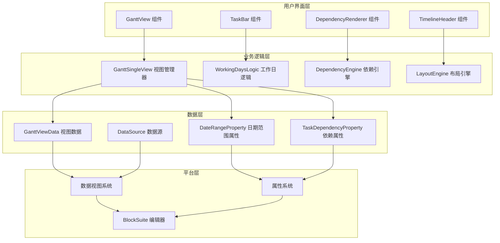
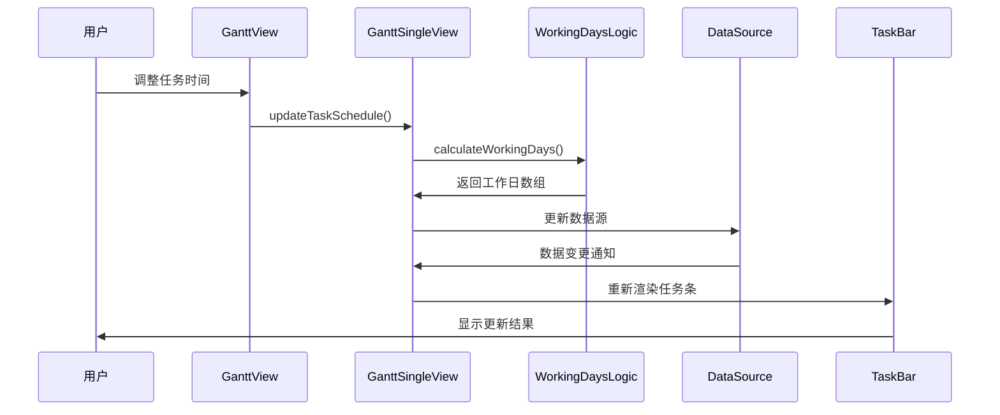

# 甘特图增强功能 - 技术架构设计

## 🏗️ 整体架构设计

### 系统架构图



---

## 📊 数据流设计

### 数据流向图



### 状态管理架构

```typescript
// 甘特图状态管理
export interface GanttViewState {
  // 视图状态
  viewState: {
    timeline: TimelineConfig;
    selection: TaskSelection;
    viewport: ViewportInfo;
  };
  
  // 数据状态
  dataState: {
    tasks: Map<string, GanttTask>;
    dependencies: Map<string, TaskDependency>;
    workingCalendar: WorkingCalendar;
  };
  
  // UI 状态
  uiState: {
    dragState: DragState | null;
    hoverTask: string | null;
    editingTask: string | null;
  };
}

// 状态更新机制
export class GanttStateManager {
  private state$ = signal<GanttViewState>(initialState);
  
  // 响应式计算
  readonly visibleTasks$ = computed(() => 
    this.filterVisibleTasks(this.state$.value)
  );
  
  readonly criticalPath$ = computed(() => 
    this.calculateCriticalPath(this.state$.value)
  );
  
  // 状态更新方法
  updateTimeline(timeline: TimelineConfig) {
    this.state$.value = {
      ...this.state$.value,
      viewState: {
        ...this.state$.value.viewState,
        timeline
      }
    };
  }
}
```

---

## 🎨 组件架构设计

### 组件层次结构

```
GanttView (根组件)
├── GanttHeader (头部工具栏)
│   ├── ViewModeSelector (视图模式选择)
│   ├── TimelineControls (时间轴控制)
│   └── GanttActions (操作按钮)
├── GanttContent (主内容区)
│   ├── TaskList (任务列表)
│   │   ├── TaskRow (任务行)
│   │   └── TaskEditor (任务编辑器)
│   └── TimelineArea (时间轴区域)
│       ├── TimelineHeader (时间轴头部)
│       ├── TaskBarsContainer (任务条容器)
│       │   ├── TaskBar (任务条)
│       │   └── WorkingDaySegment (工作日段)
│       └── DependencyLayer (依赖关系层)
│           └── DependencyArrow (依赖箭头)
└── GanttFooter (底部状态栏)
    ├── TaskSummary (任务摘要)
    └── ProgressIndicator (进度指示器)
```

### 核心组件设计

#### 1. GanttView 根组件

```typescript
// gantt/gantt-view.ts
export class GanttView extends DataViewUILogicBase<GanttViewData> {
  static override styles = css`
    .gantt-view {
      display: flex;
      flex-direction: column;
      height: 100%;
      background: var(--affine-background-primary-color);
    }
    
    .gantt-content {
      display: flex;
      flex: 1;
      min-height: 0;
    }
    
    .task-list {
      width: 300px;
      border-right: 1px solid var(--affine-border-color);
      overflow-y: auto;
    }
    
    .timeline-area {
      flex: 1;
      overflow: auto;
      position: relative;
    }
  `;
  
  @state()
  private accessor _stateManager = new GanttStateManager();
  
  @state()
  private accessor _dragHandler = new GanttDragHandler(this);
  
  protected override render() {
    const state = this._stateManager.state$.value;
    
    return html`
      <div class="gantt-view">
        <gantt-header 
          .timeline=${state.viewState.timeline}
          @timeline-change=${this._onTimelineChange}
        ></gantt-header>
        
        <div class="gantt-content">
          <div class="task-list">
            ${this.renderTaskList()}
          </div>
          
          <div class="timeline-area">
            <timeline-header 
              .timeline=${state.viewState.timeline}
            ></timeline-header>
            
            <task-bars-container
              .tasks=${state.dataState.tasks}
              .timeline=${state.viewState.timeline}
              .dragHandler=${this._dragHandler}
            ></task-bars-container>
            
            <dependency-layer
              .dependencies=${state.dataState.dependencies}
              .tasks=${state.dataState.tasks}
            ></dependency-layer>
          </div>
        </div>
        
        <gantt-footer 
          .taskCount=${state.dataState.tasks.size}
        ></gantt-footer>
      </div>
    `;
  }
  
  private _onTimelineChange(e: CustomEvent<TimelineConfig>) {
    this._stateManager.updateTimeline(e.detail);
  }
}
```

#### 2. WorkingDaySegment 工作日段组件

```typescript
// gantt/components/working-day-segment.ts
export class WorkingDaySegment extends WidgetElement {
  static override styles = css`
    .segment {
      position: absolute;
      height: var(--gantt-bar-height);
      border-radius: var(--gantt-bar-radius);
      transition: all 0.2s ease;
      cursor: pointer;
    }
    
    .segment.working {
      opacity: 1;
    }
    
    .segment.non-working {
      opacity: 0.3;
      background: transparent !important;
      border: 2px dashed currentColor;
      height: calc(var(--gantt-bar-height) / 3);
      top: 50%;
      transform: translateY(-50%);
      border-radius: 0;
    }
    
    .segment:hover {
      transform: translateY(-2px);
      box-shadow: 0 4px 8px rgba(0, 0, 0, 0.1);
    }
    
    .segment.selected {
      box-shadow: 0 0 0 2px var(--affine-primary-color);
    }
    
    .segment.dragging {
      z-index: 1000;
      transform: rotate(2deg);
    }
  `;
  
  @property({ attribute: false })
  accessor segment!: TaskSegment;
  
  @property({ attribute: false })
  accessor task!: GanttTask;
  
  @property({ attribute: false })
  accessor onSegmentClick?: (segment: TaskSegment) => void;
  
  @property({ attribute: false })
  accessor dragHandler?: GanttDragHandler;
  
  @state()
  private accessor _isDragging = false;
  
  @state()
  private accessor _isSelected = false;
  
  protected override render() {
    const { segment, task } = this;
    const style = this._getSegmentStyle();
    
    return html`
      <div 
        class="segment ${segment.isWorkingDay ? 'working' : 'non-working'} 
               ${this._isDragging ? 'dragging' : ''} 
               ${this._isSelected ? 'selected' : ''}"
        style=${style}
        title=${this._getTooltipText()}
        @click=${this._onSegmentClick}
        @mousedown=${this._onMouseDown}
        @dragstart=${this._onDragStart}
        draggable=${segment.isWorkingDay}
      >
        ${this._renderSegmentContent()}
      </div>
    `;
  }
  
  private _getSegmentStyle(): string {
    const { segment, task } = this;
    return `
      left: ${segment.left}px;
      width: ${segment.width}px;
      background-color: ${segment.isWorkingDay ? task.color : 'transparent'};
      color: ${segment.isWorkingDay ? this._getContrastColor(task.color) : task.color};
    `;
  }
  
  private _renderSegmentContent() {
    const { segment } = this;
    
    if (!segment.isWorkingDay || segment.width < 60) {
      return nothing; // 太小的段不显示文字
    }
    
    return html`
      <span class="segment-text">${segment.label}</span>
    `;
  }
  
  private _onSegmentClick(e: Event) {
    e.stopPropagation();
    this._isSelected = !this._isSelected;
    this.onSegmentClick?.(this.segment);
  }
  
  private _onDragStart(e: DragEvent) {
    if (!this.segment.isWorkingDay) {
      e.preventDefault();
      return;
    }
    
    this._isDragging = true;
    e.dataTransfer!.effectAllowed = 'move';
    e.dataTransfer!.setData('text/gantt-task', JSON.stringify({
      taskId: this.task.id,
      segmentId: this.segment.id,
    }));
    
    this.dragHandler?.startDrag(this.task, this.segment, e);
  }
  
  private _getTooltipText(): string {
    const { segment, task } = this;
    const dateFormat = 'yyyy-MM-dd';
    const start = format(segment.startDate, dateFormat);
    const end = format(segment.endDate, dateFormat);
    
    if (segment.isWorkingDay) {
      return `${task.name}\n${start} ~ ${end}\n点击选择，拖拽调整`;
    } else {
      return `非工作日连接\n${start} ~ ${end}`;
    }
  }
  
  private _getContrastColor(backgroundColor: string): string {
    // 计算对比色，确保文字可读性
    const rgb = this._hexToRgb(backgroundColor);
    if (!rgb) return '#000';
    
    const brightness = (rgb.r * 299 + rgb.g * 587 + rgb.b * 114) / 1000;
    return brightness > 128 ? '#000' : '#fff';
  }
}
```

#### 3. DependencyArrow 依赖箭头组件

```typescript
// gantt/components/dependency-arrow.ts
export class DependencyArrow extends WidgetElement {
  static override styles = css`
    .dependency-arrow {
      position: absolute;
      pointer-events: none;
      z-index: 100;
    }
    
    .dependency-line {
      stroke: var(--gantt-dependency-color);
      stroke-width: var(--gantt-dependency-width);
      fill: none;
      marker-end: url(#arrowhead);
    }
    
    .dependency-line.critical {
      stroke: var(--affine-error-color);
      stroke-width: 3px;
    }
    
    .dependency-line:hover {
      stroke: var(--affine-primary-color);
      stroke-width: 3px;
      cursor: pointer;
    }
    
    .dependency-label {
      font-size: 10px;
      fill: var(--affine-text-secondary-color);
      text-anchor: middle;
      pointer-events: all;
    }
  `;
  
  @property({ attribute: false })
  accessor dependency!: TaskDependency;
  
  @property({ attribute: false })
  accessor fromTask!: GanttTask;
  
  @property({ attribute: false })
  accessor toTask!: GanttTask;
  
  @property({ attribute: false })
  accessor timeline!: TimelineConfig;
  
  @property({ type: Boolean })
  accessor isCritical = false;
  
  protected override render() {
    const path = this._calculateArrowPath();
    const labelPosition = this._getLabelPosition();
    
    return html`
      <svg class="dependency-arrow" width="100%" height="100%">
        <defs>
          <marker
            id="arrowhead"
            markerWidth="10"
            markerHeight="7"
            refX="10"
            refY="3.5"
            orient="auto"
          >
            <polygon
              points="0 0, 10 3.5, 0 7"
              fill="var(--gantt-dependency-color)"
            />
          </marker>
        </defs>
        
        <path
          class="dependency-line ${this.isCritical ? 'critical' : ''}"
          d=${path}
          title=${this._getDependencyTooltip()}
          @click=${this._onDependencyClick}
        />
        
        ${this._renderLabel(labelPosition)}
      </svg>
    `;
  }
  
  private _calculateArrowPath(): string {
    const { fromTask, toTask, dependency } = this;
    
    // 根据依赖类型计算起点和终点
    const startPoint = this._getConnectionPoint(fromTask, dependency.type, 'start');
    const endPoint = this._getConnectionPoint(toTask, dependency.type, 'end');
    
    // 计算控制点，创建平滑的贝塞尔曲线
    const controlPoint1 = {
      x: startPoint.x + 50,
      y: startPoint.y,
    };
    
    const controlPoint2 = {
      x: endPoint.x - 50,
      y: endPoint.y,
    };
    
    return `M ${startPoint.x} ${startPoint.y} 
            C ${controlPoint1.x} ${controlPoint1.y} 
              ${controlPoint2.x} ${controlPoint2.y} 
              ${endPoint.x} ${endPoint.y}`;
  }
  
  private _getConnectionPoint(
    task: GanttTask, 
    depType: DependencyType, 
    side: 'start' | 'end'
  ): Point {
    const taskElement = this._getTaskElement(task.id);
    if (!taskElement) return { x: 0, y: 0 };
    
    const rect = taskElement.getBoundingClientRect();
    const containerRect = this.closest('.timeline-area')!.getBoundingClientRect();
    
    const relativeRect = {
      left: rect.left - containerRect.left,
      top: rect.top - containerRect.top,
      right: rect.right - containerRect.left,
      bottom: rect.bottom - containerRect.top,
      centerY: (rect.top + rect.bottom) / 2 - containerRect.top,
    };
    
    // 根据依赖类型和连接方向确定连接点
    switch (depType) {
      case 'finish-to-start':
        return side === 'start' 
          ? { x: relativeRect.right, y: relativeRect.centerY }
          : { x: relativeRect.left, y: relativeRect.centerY };
          
      case 'start-to-start':
        return { x: relativeRect.left, y: relativeRect.centerY };
        
      case 'finish-to-finish':
        return { x: relativeRect.right, y: relativeRect.centerY };
        
      case 'start-to-finish':
        return side === 'start'
          ? { x: relativeRect.left, y: relativeRect.centerY }
          : { x: relativeRect.right, y: relativeRect.centerY };
          
      default:
        return { x: relativeRect.right, y: relativeRect.centerY };
    }
  }
}
```

---

## 💾 数据模型设计

### 核心数据结构

```typescript
// gantt/types/data-models.ts

// 甘特图任务模型
export interface GanttTask {
  id: string;
  name: string;
  description?: string;
  
  // 时间信息
  startDate: number;    // Unix 时间戳
  endDate: number;      // Unix 时间戳
  duration: number;     // 工作日天数
  
  // 工作日配置
  workingDays: number[]; // [1,2,3,4,5] 周一到周五
  workingHours?: {
    start: string;      // "09:00"
    end: string;        // "18:00"
  };
  
  // 进度信息
  progress: number;     // 0-100
  status: TaskStatus;
  
  // 视觉属性
  color: string;
  priority: TaskPriority;
  
  // 层级信息
  parentId?: string;
  level: number;
  isCollapsed?: boolean;
  
  // 资源信息
  assignees: string[];
  estimatedHours?: number;
  actualHours?: number;
  
  // 元数据
  tags: string[];
  customFields: Record<string, unknown>;
  createdAt: number;
  updatedAt: number;
}

// 任务依赖关系
export interface TaskDependency {
  id: string;
  fromTaskId: string;
  toTaskId: string;
  type: DependencyType;
  lag: number;          // 延迟天数，可以为负数
  
  // 约束条件
  isFlexible: boolean;  // 是否允许拖拽时自动调整
  constraint?: DependencyConstraint;
  
  // 元数据
  createdAt: number;
  updatedAt: number;
}

// 依赖类型
export type DependencyType = 
  | 'finish-to-start'   // 前置任务完成后，后续任务开始
  | 'start-to-start'    // 前置任务开始后，后续任务开始
  | 'finish-to-finish'  // 前置任务完成后，后续任务完成
  | 'start-to-finish';  // 前置任务开始后，后续任务完成

// 任务状态
export enum TaskStatus {
  NOT_STARTED = 'not_started',
  IN_PROGRESS = 'in_progress',
  COMPLETED = 'completed',
  ON_HOLD = 'on_hold',
  CANCELLED = 'cancelled',
}

// 任务优先级
export enum TaskPriority {
  LOW = 'low',
  MEDIUM = 'medium', 
  HIGH = 'high',
  CRITICAL = 'critical',
}

// 工作日历配置
export interface WorkingCalendar {
  id: string;
  name: string;
  
  // 标准工作日
  workingDays: number[];    // [1,2,3,4,5]
  workingHours: {
    start: string;          // "09:00"
    end: string;            // "18:00"
  };
  
  // 节假日
  holidays: Holiday[];
  
  // 特殊工作日 (调休)
  specialWorkingDays: Date[];
  
  // 时区
  timezone: string;         // "Asia/Shanghai"
}

// 节假日定义
export interface Holiday {
  id: string;
  name: string;
  date: Date;
  isRecurring: boolean;     // 是否每年重复
  type: 'national' | 'company' | 'personal';
}
```

### 数据计算引擎

```typescript
// gantt/engine/calculation-engine.ts

/**
 * 甘特图计算引擎
 * 负责任务调度、依赖计算、关键路径分析等核心算法
 */
export class GanttCalculationEngine {
  constructor(
    private calendar: WorkingCalendar,
    private tasks: Map<string, GanttTask>,
    private dependencies: Map<string, TaskDependency>
  ) {}
  
  /**
   * 计算任务的实际工作日
   * 根据工作日历，排除周末和节假日
   */
  calculateWorkingDays(startDate: Date, endDate: Date, workingDays: number[]): Date[] {
    const result: Date[] = [];
    const current = new Date(startDate);
    
    while (current <= endDate) {
      const dayOfWeek = current.getDay();
      
      // 检查是否为工作日
      if (workingDays.includes(dayOfWeek)) {
        // 检查是否为节假日
        if (!this.isHoliday(current)) {
          result.push(new Date(current));
        }
      }
      
      current.setDate(current.getDate() + 1);
    }
    
    return result;
  }
  
  /**
   * 计算关键路径
   * 使用关键路径方法 (CPM) 算法
   */
  calculateCriticalPath(): CriticalPathResult {
    const tasks = Array.from(this.tasks.values());
    const dependencies = Array.from(this.dependencies.values());
    
    // 1. 正向遍历：计算最早开始时间 (ES) 和最早完成时间 (EF)
    const forwardPass = this.performForwardPass(tasks, dependencies);
    
    // 2. 反向遍历：计算最晚开始时间 (LS) 和最晚完成时间 (LF)
    const backwardPass = this.performBackwardPass(tasks, dependencies, forwardPass);
    
    // 3. 计算总浮动时间 (Total Float)
    const floatCalculation = this.calculateFloat(forwardPass, backwardPass);
    
    // 4. 识别关键路径（总浮动时间为0的任务）
    const criticalTasks = tasks.filter(task => 
      floatCalculation.get(task.id)?.totalFloat === 0
    );
    
    return {
      criticalTasks: criticalTasks.map(t => t.id),
      criticalPath: this.buildCriticalPath(criticalTasks, dependencies),
      projectDuration: Math.max(...Array.from(backwardPass.values()).map(p => p.lf)),
      taskSchedules: new Map([...forwardPass, ...backwardPass].map(([id, data]) => [
        id,
        {
          ...data,
          ...backwardPass.get(id)!,
          totalFloat: floatCalculation.get(id)?.totalFloat || 0,
          freeFloat: floatCalculation.get(id)?.freeFloat || 0,
        }
      ])),
    };
  }
  
  /**
   * 自动调度任务
   * 根据依赖关系和约束条件自动安排任务时间
   */
  autoScheduleTasks(constraints: SchedulingConstraints = {}): SchedulingResult {
    const {
      projectStartDate = new Date(),
      projectEndDate,
      resourceLeveling = false,
      bufferDays = 0,
    } = constraints;
    
    const sortedTasks = this.topologicalSort();
    const scheduledTasks = new Map<string, ScheduledTask>();
    
    for (const task of sortedTasks) {
      const predecessors = this.getPredecessorTasks(task.id);
      let earliestStart = new Date(projectStartDate);
      
      // 计算基于依赖关系的最早开始时间
      for (const predecessor of predecessors) {
        const dep = this.dependencies.get(`${predecessor.id}-${task.id}`);
        if (!dep) continue;
        
        const predSchedule = scheduledTasks.get(predecessor.id);
        if (!predSchedule) continue;
        
        const constraintDate = this.calculateConstraintDate(
          predSchedule,
          dep.type,
          dep.lag
        );
        
        if (constraintDate > earliestStart) {
          earliestStart = constraintDate;
        }
      }
      
      // 确保开始日期是工作日
      earliestStart = this.adjustToWorkingDay(earliestStart);
      
      // 计算结束日期
      const endDate = this.addWorkingDays(
        earliestStart,
        task.duration + bufferDays,
        task.workingDays
      );
      
      scheduledTasks.set(task.id, {
        taskId: task.id,
        scheduledStart: earliestStart,
        scheduledEnd: endDate,
        actualWorkingDays: this.calculateWorkingDays(
          earliestStart,
          endDate,
          task.workingDays
        ),
      });
    }
    
    return {
      scheduledTasks,
      projectEndDate: this.calculateProjectEndDate(scheduledTasks),
      conflicts: this.detectResourceConflicts(scheduledTasks),
      warnings: this.validateSchedule(scheduledTasks),
    };
  }
  
  // 私有辅助方法...
  private isHoliday(date: Date): boolean {
    return this.calendar.holidays.some(holiday => 
      this.isSameDay(holiday.date, date)
    );
  }
  
  private topologicalSort(): GanttTask[] {
    // 拓扑排序实现
    const visited = new Set<string>();
    const result: GanttTask[] = [];
    
    const visit = (taskId: string) => {
      if (visited.has(taskId)) return;
      visited.add(taskId);
      
      // 先访问依赖任务
      const dependencies = Array.from(this.dependencies.values())
        .filter(dep => dep.toTaskId === taskId);
      
      for (const dep of dependencies) {
        visit(dep.fromTaskId);
      }
      
      const task = this.tasks.get(taskId);
      if (task) {
        result.push(task);
      }
    };
    
    for (const task of this.tasks.values()) {
      visit(task.id);
    }
    
    return result;
  }
}

// 计算结果类型定义
export interface CriticalPathResult {
  criticalTasks: string[];
  criticalPath: string[];
  projectDuration: number;
  taskSchedules: Map<string, TaskScheduleInfo>;
}

export interface TaskScheduleInfo {
  es: number;  // 最早开始时间
  ef: number;  // 最早完成时间
  ls: number;  // 最晚开始时间
  lf: number;  // 最晚完成时间
  totalFloat: number;  // 总浮动时间
  freeFloat: number;   // 自由浮动时间
}

export interface SchedulingConstraints {
  projectStartDate?: Date;
  projectEndDate?: Date;
  resourceLeveling?: boolean;
  bufferDays?: number;
  prioritizeBy?: 'duration' | 'priority' | 'dependencies';
}
```

---

## 🔧 工具函数库

### 日期计算工具

```typescript
// gantt/utils/date-utils.ts

/**
 * 甘特图专用日期工具函数
 */
export class GanttDateUtils {
  
  /**
   * 在工作日基础上添加指定天数
   * @param startDate 开始日期
   * @param days 要添加的工作日天数
   * @param workingDays 工作日数组 [1,2,3,4,5]
   * @param calendar 工作日历
   */
  static addWorkingDays(
    startDate: Date,
    days: number,
    workingDays: number[] = [1, 2, 3, 4, 5],
    calendar?: WorkingCalendar
  ): Date {
    const result = new Date(startDate);
    let addedDays = 0;
    
    while (addedDays < days) {
      result.setDate(result.getDate() + 1);
      
      const dayOfWeek = result.getDay();
      const isWorkingDay = workingDays.includes(dayOfWeek);
      const isHoliday = calendar ? this.isHoliday(result, calendar) : false;
      
      if (isWorkingDay && !isHoliday) {
        addedDays++;
      }
    }
    
    return result;
  }
  
  /**
   * 计算两个日期之间的工作日天数
   */
  static calculateWorkingDaysBetween(
    startDate: Date,
    endDate: Date,
    workingDays: number[] = [1, 2, 3, 4, 5],
    calendar?: WorkingCalendar
  ): number {
    let count = 0;
    const current = new Date(startDate);
    
    while (current < endDate) {
      const dayOfWeek = current.getDay();
      const isWorkingDay = workingDays.includes(dayOfWeek);
      const isHoliday = calendar ? this.isHoliday(current, calendar) : false;
      
      if (isWorkingDay && !isHoliday) {
        count++;
      }
      
      current.setDate(current.getDate() + 1);
    }
    
    return count;
  }
  
  /**
   * 获取日期范围内的所有工作日
   */
  static getWorkingDaysInRange(
    startDate: Date,
    endDate: Date,
    workingDays: number[] = [1, 2, 3, 4, 5],
    calendar?: WorkingCalendar
  ): Date[] {
    const result: Date[] = [];
    const current = new Date(startDate);
    
    while (current <= endDate) {
      const dayOfWeek = current.getDay();
      const isWorkingDay = workingDays.includes(dayOfWeek);
      const isHoliday = calendar ? this.isHoliday(current, calendar) : false;
      
      if (isWorkingDay && !isHoliday) {
        result.push(new Date(current));
      }
      
      current.setDate(current.getDate() + 1);
    }
    
    return result;
  }
  
  /**
   * 将日期调整到最近的工作日
   */
  static adjustToWorkingDay(
    date: Date,
    workingDays: number[] = [1, 2, 3, 4, 5],
    direction: 'forward' | 'backward' = 'forward',
    calendar?: WorkingCalendar
  ): Date {
    const result = new Date(date);
    const increment = direction === 'forward' ? 1 : -1;
    
    while (true) {
      const dayOfWeek = result.getDay();
      const isWorkingDay = workingDays.includes(dayOfWeek);
      const isHoliday = calendar ? this.isHoliday(result, calendar) : false;
      
      if (isWorkingDay && !isHoliday) {
        break;
      }
      
      result.setDate(result.getDate() + increment);
    }
    
    return result;
  }
  
  /**
   * 生成时间轴单位数组
   */
  static generateTimelineUnits(
    startDate: Date,
    endDate: Date,
    unit: 'day' | 'week' | 'month',
    unitWidth: number = 60
  ): TimelineUnit[] {
    const units: TimelineUnit[] = [];
    const current = new Date(startDate);
    let position = 0;
    
    while (current <= endDate) {
      const unitStart = new Date(current);
      let unitEnd: Date;
      let label: string;
      
      switch (unit) {
        case 'day':
          unitEnd = new Date(current);
          unitEnd.setDate(unitEnd.getDate() + 1);
          label = format(current, 'MM-dd');
          current.setDate(current.getDate() + 1);
          break;
          
        case 'week':
          // 调整到周一
          const startOfWeek = startOfWeekFunc(current, { weekStartsOn: 1 });
          unitEnd = new Date(startOfWeek);
          unitEnd.setDate(unitEnd.getDate() + 7);
          label = `第${getISOWeek(current)}周`;
          current.setDate(current.getDate() + 7);
          break;
          
        case 'month':
          unitEnd = new Date(current.getFullYear(), current.getMonth() + 1, 1);
          label = format(current, 'yyyy-MM');
          current.setMonth(current.getMonth() + 1);
          break;
          
        default:
          throw new Error(`Unsupported unit: ${unit}`);
      }
      
      units.push({
        date: unitStart,
        endDate: unitEnd,
        label,
        position,
        width: unitWidth,
        isWeekend: unit === 'day' && this.isWeekend(unitStart),
        isToday: unit === 'day' && this.isToday(unitStart),
      });
      
      position += unitWidth;
    }
    
    return units;
  }
  
  private static isHoliday(date: Date, calendar: WorkingCalendar): boolean {
    return calendar.holidays.some(holiday => 
      this.isSameDay(holiday.date, date)
    );
  }
  
  private static isWeekend(date: Date): boolean {
    const day = date.getDay();
    return day === 0 || day === 6;
  }
  
  private static isToday(date: Date): boolean {
    return this.isSameDay(date, new Date());
  }
  
  private static isSameDay(date1: Date, date2: Date): boolean {
    return date1.getFullYear() === date2.getFullYear() &&
           date1.getMonth() === date2.getMonth() &&
           date1.getDate() === date2.getDate();
  }
}

// 时间轴单位类型
export interface TimelineUnit {
  date: Date;
  endDate: Date;
  label: string;
  position: number;
  width: number;
  isWeekend: boolean;
  isToday: boolean;
}
```

---

## 🎯 性能优化策略

### 虚拟化渲染

```typescript
// gantt/performance/virtual-timeline.ts

/**
 * 甘特图虚拟化渲染器
 * 仅渲染可视区域内的任务和时间单位，优化大量数据时的性能
 */
export class VirtualGanttRenderer {
  private viewport: ViewportInfo;
  private renderCache = new Map<string, RenderedItem>();
  private intersectionObserver: IntersectionObserver;
  
  constructor(
    private container: HTMLElement,
    private config: VirtualRenderConfig
  ) {
    this.viewport = this.calculateViewport();
    this.setupIntersectionObserver();
  }
  
  /**
   * 渲染可视区域内的任务
   */
  renderVisibleTasks(tasks: GanttTask[], timeline: TimelineConfig): RenderResult {
    const visibleRange = this.calculateVisibleDateRange(timeline);
    const visibleTasks = this.filterVisibleTasks(tasks, visibleRange);
    
    // 使用时间分片避免长时间占用主线程
    return this.renderInChunks(visibleTasks, {
      chunkSize: 50,
      frameTimeout: 16, // 16ms per frame for 60fps
    });
  }
  
  /**
   * 分块渲染，避免阻塞UI
   */
  private async renderInChunks<T>(
    items: T[],
    options: ChunkRenderOptions
  ): Promise<RenderResult> {
    const { chunkSize, frameTimeout } = options;
    const chunks = this.chunkArray(items, chunkSize);
    const results: RenderedItem[] = [];
    
    for (const chunk of chunks) {
      const chunkResults = await new Promise<RenderedItem[]>((resolve) => {
        const startTime = performance.now();
        const chunkRendered: RenderedItem[] = [];
        
        for (const item of chunk) {
          chunkRendered.push(this.renderItem(item));
          
          // 如果超过帧预算，暂停渲染
          if (performance.now() - startTime > frameTimeout) {
            break;
          }
        }
        
        // 在下一帧继续渲染
        requestAnimationFrame(() => resolve(chunkRendered));
      });
      
      results.push(...chunkResults);
    }
    
    return { renderedItems: results };
  }
  
  /**
   * 智能缓存策略
   */
  private getCachedRender(key: string): RenderedItem | null {
    const cached = this.renderCache.get(key);
    if (!cached) return null;
    
    // 检查缓存是否过期
    if (Date.now() - cached.timestamp > this.config.cacheTimeout) {
      this.renderCache.delete(key);
      return null;
    }
    
    return cached;
  }
  
  private setCachedRender(key: string, item: RenderedItem): void {
    // 限制缓存大小
    if (this.renderCache.size > this.config.maxCacheSize) {
      const oldestKey = this.renderCache.keys().next().value;
      this.renderCache.delete(oldestKey);
    }
    
    this.renderCache.set(key, {
      ...item,
      timestamp: Date.now(),
    });
  }
}

// 配置接口
export interface VirtualRenderConfig {
  overscan: number;           // 预渲染的额外项目数
  itemHeight: number;         // 单项高度
  cacheTimeout: number;       // 缓存超时时间 (ms)
  maxCacheSize: number;       // 最大缓存项目数
  enableIntersectionObserver: boolean; // 是否启用交集观察器
}

export interface ChunkRenderOptions {
  chunkSize: number;          // 每块大小
  frameTimeout: number;       // 每帧超时时间 (ms)
}
```

### 内存管理

```typescript
// gantt/performance/memory-manager.ts

/**
 * 甘特图内存管理器
 * 监控和优化内存使用，防止内存泄漏
 */
export class GanttMemoryManager {
  private memoryUsage = new Map<string, MemoryMetric>();
  private cleanupTasks = new Set<() => void>();
  private observer: PerformanceObserver;
  
  constructor() {
    this.setupMemoryMonitoring();
  }
  
  /**
   * 监控组件内存使用
   */
  trackComponent(componentId: string, component: object): void {
    const metric: MemoryMetric = {
      componentId,
      initialMemory: this.getCurrentMemoryUsage(),
      peakMemory: 0,
      createdAt: Date.now(),
      cleanupCallbacks: new Set(),
    };
    
    this.memoryUsage.set(componentId, metric);
    
    // 添加清理回调
    this.addCleanupTask(() => {
      this.untrackComponent(componentId);
    });
  }
  
  /**
   * 自动清理不再使用的资源
   */
  performGarbageCollection(): void {
    // 清理过期的缓存
    this.cleanupExpiredCache();
    
    // 清理断开的事件监听器
    this.cleanupEventListeners();
    
    // 清理未使用的DOM元素引用
    this.cleanupDOMReferences();
    
    // 强制垃圾回收 (仅在开发环境)
    if (typeof window !== 'undefined' && window.gc) {
      window.gc();
    }
  }
  
  /**
   * 内存使用报告
   */
  getMemoryReport(): MemoryReport {
    const totalMemory = this.getCurrentMemoryUsage();
    const componentMemory = Array.from(this.memoryUsage.values());
    
    return {
      totalMemory,
      componentCount: componentMemory.length,
      componentBreakdown: componentMemory.map(metric => ({
        componentId: metric.componentId,
        memoryDelta: metric.peakMemory - metric.initialMemory,
        lifespan: Date.now() - metric.createdAt,
      })),
      suggestions: this.generateOptimizationSuggestions(),
    };
  }
  
  private getCurrentMemoryUsage(): number {
    if (typeof performance !== 'undefined' && performance.memory) {
      return performance.memory.usedJSHeapSize;
    }
    return 0;
  }
  
  private generateOptimizationSuggestions(): OptimizationSuggestion[] {
    const suggestions: OptimizationSuggestion[] = [];
    
    // 检查内存使用异常的组件
    for (const [id, metric] of this.memoryUsage) {
      const memoryDelta = metric.peakMemory - metric.initialMemory;
      const lifespan = Date.now() - metric.createdAt;
      
      if (memoryDelta > 10 * 1024 * 1024) { // 10MB
        suggestions.push({
          type: 'high-memory-usage',
          componentId: id,
          description: `组件 ${id} 使用了过多内存 (${(memoryDelta / 1024 / 1024).toFixed(2)}MB)`,
          recommendation: '考虑使用虚拟化或分页渲染',
        });
      }
      
      if (lifespan > 5 * 60 * 1000) { // 5分钟
        suggestions.push({
          type: 'long-lived-component',
          componentId: id,
          description: `组件 ${id} 存在时间过长 (${(lifespan / 1000 / 60).toFixed(1)}分钟)`,
          recommendation: '检查是否存在内存泄漏',
        });
      }
    }
    
    return suggestions;
  }
}

// 内存监控接口
export interface MemoryMetric {
  componentId: string;
  initialMemory: number;
  peakMemory: number;
  createdAt: number;
  cleanupCallbacks: Set<() => void>;
}

export interface MemoryReport {
  totalMemory: number;
  componentCount: number;
  componentBreakdown: ComponentMemoryInfo[];
  suggestions: OptimizationSuggestion[];
}

export interface OptimizationSuggestion {
  type: string;
  componentId: string;
  description: string;
  recommendation: string;
}
```

---

**文档版本**: v1.0  
**创建时间**: 2025-01-25  
**维护者**: 开发团队  
**状态**: 技术架构设计完成