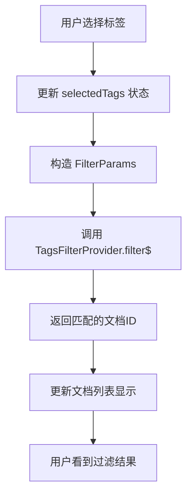
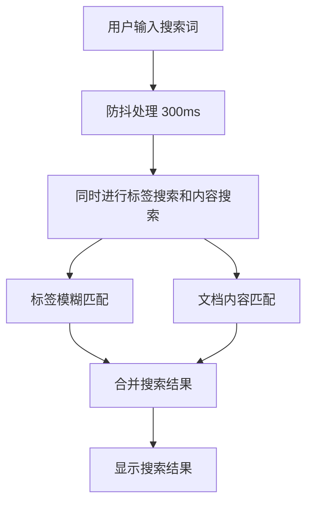

# API 设计文档

## 🏗️ 架构概览

多标签 AND 逻辑搜索功能主要基于现有的 `TagsFilterProvider` 和标签服务系统，无需新增后端 API，主要工作集中在前端组件开发和数据流优化。

---

## 📡 现有 API 分析

### TagsFilterProvider API
**位置**: `packages/frontend/core/src/modules/collection-rules/impls/filters/tags.ts`

#### 核心方法
```typescript
class TagsFilterProvider {
  filter$(params: FilterParams): Observable<Set<string>>
}
```

#### 支持的过滤方法
```typescript
type TagFilterMethod = 
  | 'include-all'        // AND 逻辑 - 必须包含所有标签
  | 'include-any-of'     // OR 逻辑 - 包含任意一个标签
  | 'not-include-all'    // NOT AND - 不包含所有标签
  | 'not-include-any-of' // NOT OR - 不包含任意标签
  | 'is-empty'          // 无标签
  | 'is-not-empty'      // 有标签
```

#### 输入参数
```typescript
interface FilterParams {
  method: TagFilterMethod;
  value?: string; // 逗号分隔的标签ID列表: "tag1,tag2,tag3"
}
```

#### 输出结果
```typescript
Observable<Set<string>> // 匹配的文档ID集合
```

---

## 🔄 数据流设计

### 标签过滤器数据流


### 实时搜索数据流


---

## 🛠️ 新增组件 API

### 1. TagFilterBar 组件

#### Props 接口
```typescript
interface TagFilterBarProps {
  // 当前选中的标签
  selectedTags: Tag[];
  
  // 标签变化回调
  onTagsChange: (tags: Tag[]) => void;
  
  // 可用标签列表
  availableTags: Tag[];
  
  // 是否显示搜索框
  showSearch?: boolean;
  
  // 搜索框占位符
  searchPlaceholder?: string;
  
  // 最大显示标签数量
  maxDisplayTags?: number;
  
  // 加载状态
  loading?: boolean;
  
  // 是否禁用
  disabled?: boolean;
  
  // 样式类名
  className?: string;
}
```

#### State 管理
```typescript
interface TagFilterBarState {
  // 搜索关键词
  searchKeyword: string;
  
  // 是否显示标签选择器
  showSelector: boolean;
  
  // 过滤后的标签列表
  filteredTags: Tag[];
  
  // 加载状态
  loading: boolean;
  
  // 错误状态
  error: string | null;
}
```

### 2. TagSelector 组件

#### Props 接口
```typescript
interface TagSelectorProps {
  // 所有可用标签
  tags: Tag[];
  
  // 当前选中的标签
  selectedTags: Tag[];
  
  // 选择标签回调
  onSelect: (tag: Tag) => void;
  
  // 取消选择回调
  onDeselect: (tag: Tag) => void;
  
  // 是否支持搜索
  searchable?: boolean;
  
  // 是否显示文档计数
  showDocCount?: boolean;
  
  // 最大高度
  maxHeight?: number;
  
  // 选择模式
  mode?: 'single' | 'multiple';
  
  // 关闭回调
  onClose?: () => void;
}
```

### 3. MultiTagSearch Hook

#### 使用接口
```typescript
function useMultiTagSearch(options?: MultiTagSearchOptions) {
  return {
    // 当前选中的标签
    selectedTags: Tag[];
    
    // 搜索结果
    searchResults: DocumentSearchResult[];
    
    // 加载状态
    loading: boolean;
    
    // 错误状态
    error: string | null;
    
    // 操作方法
    addTag: (tag: Tag) => void;
    removeTag: (tag: Tag) => void;
    clearTags: () => void;
    setSearchKeyword: (keyword: string) => void;
    
    // 搜索统计
    totalResults: number;
    filteredByTags: number;
    filteredByKeyword: number;
  };
}

interface MultiTagSearchOptions {
  // 初始标签
  initialTags?: Tag[];
  
  // 初始搜索词
  initialKeyword?: string;
  
  // 搜索防抖时间
  debounceMs?: number;
  
  // 是否启用缓存
  enableCache?: boolean;
  
  // 最大结果数量
  maxResults?: number;
}
```

---

## 🔍 搜索算法设计

### 多标签 AND 逻辑实现
```typescript
class MultiTagSearchService {
  // 基于现有 TagsFilterProvider 的 AND 搜索
  async searchByTags(tagIds: string[]): Promise<Set<string>> {
    const filterParams: FilterParams = {
      method: 'include-all',
      value: tagIds.join(',')
    };
    
    return await firstValueFrom(
      this.tagsFilterProvider.filter$(filterParams)
    );
  }
  
  // 结合关键词搜索
  async searchByTagsAndKeyword(
    tagIds: string[], 
    keyword: string
  ): Promise<SearchResult[]> {
    // 1. 先用标签过滤
    const tagFilteredDocIds = await this.searchByTags(tagIds);
    
    // 2. 再在结果中进行关键词搜索
    const keywordResults = await this.searchByKeyword(keyword);
    
    // 3. 取交集
    const finalResults = keywordResults.filter(
      result => tagFilteredDocIds.has(result.docId)
    );
    
    return finalResults;
  }
}
```

### 搜索结果排序
```typescript
interface SearchResultSorter {
  // 排序选项
  sortBy: 'relevance' | 'updated' | 'created' | 'title';
  
  // 排序方向
  direction: 'asc' | 'desc';
  
  // 自定义排序函数
  customSort?: (a: SearchResult, b: SearchResult) => number;
}

// 相关性得分计算
function calculateRelevanceScore(
  result: SearchResult,
  searchContext: {
    selectedTags: Tag[];
    keyword: string;
  }
): number {
  let score = 0;
  
  // 标签匹配得分 (权重: 40%)
  const tagScore = result.matchedTags.length / searchContext.selectedTags.length;
  score += tagScore * 0.4;
  
  // 关键词匹配得分 (权重: 40%)
  const keywordScore = result.keywordMatches.length / searchContext.keyword.length;
  score += keywordScore * 0.4;
  
  // 时间新鲜度得分 (权重: 20%)
  const daysSinceUpdate = (Date.now() - result.updatedAt) / (1000 * 60 * 60 * 24);
  const freshnessScore = Math.max(0, 1 - daysSinceUpdate / 365);
  score += freshnessScore * 0.2;
  
  return score;
}
```

---

## 🎯 性能优化策略

### 1. 缓存策略
```typescript
interface SearchCache {
  // 标签过滤结果缓存
  tagFilterCache: Map<string, Set<string>>;
  
  // 搜索结果缓存
  searchResultCache: Map<string, SearchResult[]>;
  
  // 缓存失效时间 (5分钟)
  cacheExpiryMs: number;
  
  // 获取缓存键
  getCacheKey(tagIds: string[], keyword: string): string;
  
  // 清理过期缓存
  cleanup(): void;
}
```

### 2. 虚拟化列表
```typescript
interface VirtualizedTagListProps {
  // 标签总数
  totalCount: number;
  
  // 可见区域高度
  containerHeight: number;
  
  // 单个标签高度
  itemHeight: number;
  
  // 渲染函数
  renderItem: (index: number, tag: Tag) => React.ReactNode;
  
  // 预渲染数量
  overscan?: number;
}
```

### 3. 搜索防抖
```typescript
interface DebounceOptions {
  // 防抖延迟 (默认 300ms)
  delay?: number;
  
  // 是否立即执行第一次
  immediate?: boolean;
  
  // 最大延迟时间
  maxWait?: number;
}

function useDebounce<T>(
  value: T,
  options: DebounceOptions = {}
): T {
  // 实现防抖逻辑
}
```

---

## 📊 数据格式规范

### Tag 实体
```typescript
interface Tag {
  id: string;
  name: string;
  color: string;
  createdAt: string;
  updatedAt: string;
  documentCount: number;
  
  // 扩展属性
  description?: string;
  category?: string;
  isSystem?: boolean;
}
```

### SearchResult 实体
```typescript
interface SearchResult {
  docId: string;
  title: string;
  content: string;
  excerpt: string;
  
  // 匹配信息
  matchedTags: Tag[];
  keywordMatches: MatchInfo[];
  
  // 元数据
  createdAt: string;
  updatedAt: string;
  author: string;
  
  // 相关性得分
  relevanceScore: number;
}

interface MatchInfo {
  field: 'title' | 'content';
  start: number;
  end: number;
  text: string;
}
```

### FilterState 状态
```typescript
interface FilterState {
  // 标签过滤
  selectedTags: Tag[];
  tagFilterMode: 'and' | 'or';
  
  // 关键词搜索
  keyword: string;
  searchFields: ('title' | 'content')[];
  
  // 排序设置
  sortBy: string;
  sortDirection: 'asc' | 'desc';
  
  // 分页设置
  page: number;
  pageSize: number;
  
  // 时间过滤
  dateRange?: {
    start: string;
    end: string;
  };
}
```

---

## 🔗 集成接口

### 与现有搜索系统集成
```typescript
// 扩展现有的快速搜索
interface QuickSearchExtension {
  // 注册多标签搜索提供器
  registerMultiTagProvider(): void;
  
  // 支持搜索语法: tag:工作 tag:重要
  parsSearchSyntax(query: string): ParsedQuery;
  
  // 合并搜索结果
  mergeResults(
    tagResults: SearchResult[],
    contentResults: SearchResult[]
  ): SearchResult[];
}

interface ParsedQuery {
  tags: string[];
  keywords: string[];
  operators: ('and' | 'or' | 'not')[];
}
```

### 与文档列表集成
```typescript
// 文档列表组件扩展
interface DocumentListExtension {
  // 添加过滤器栏
  addFilterBar(position: 'top' | 'sidebar'): void;
  
  // 更新过滤条件
  updateFilters(filters: FilterState): void;
  
  // 高亮匹配内容
  highlightMatches(matches: MatchInfo[]): void;
}
```

---

## 🚀 部署和监控

### 错误处理
```typescript
interface ErrorHandler {
  // 搜索错误
  handleSearchError(error: Error, context: SearchContext): void;
  
  // 网络错误
  handleNetworkError(error: NetworkError): void;
  
  // 用户错误 (如无效标签)
  handleUserError(error: UserError): void;
}
```

### 性能监控
```typescript
interface PerformanceMetrics {
  // 搜索响应时间
  searchLatency: number;
  
  // 缓存命中率
  cacheHitRate: number;
  
  // 内存使用量
  memoryUsage: number;
  
  // 用户操作统计
  userActions: {
    tagSelections: number;
    searches: number;
    resultClicks: number;
  };
}
```

---

**文档版本**: v1.0  
**创建时间**: 2025-01-25  
**技术负责人**: 开发团队