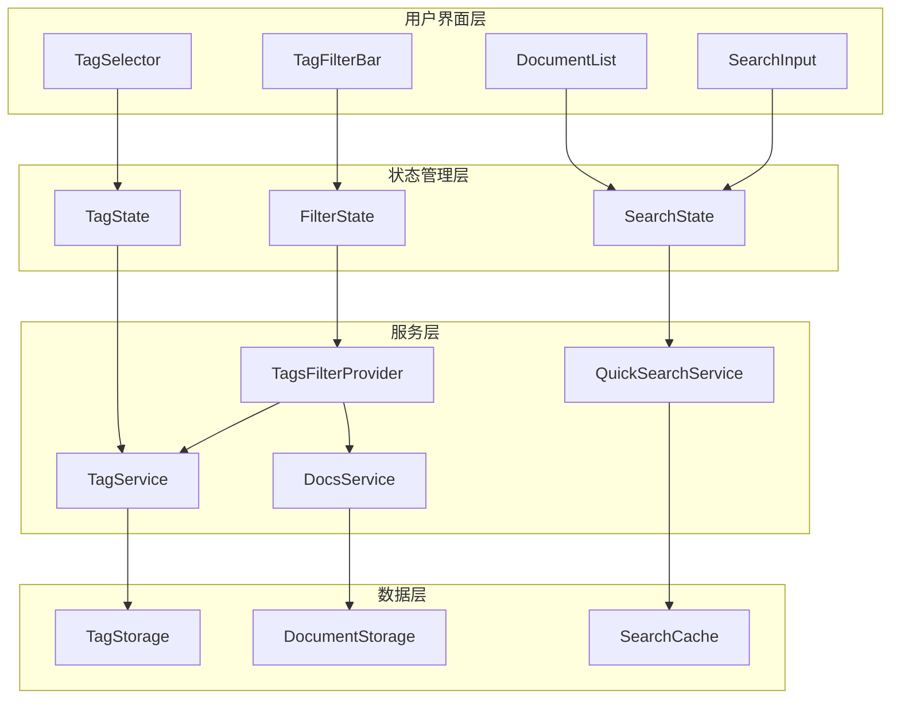
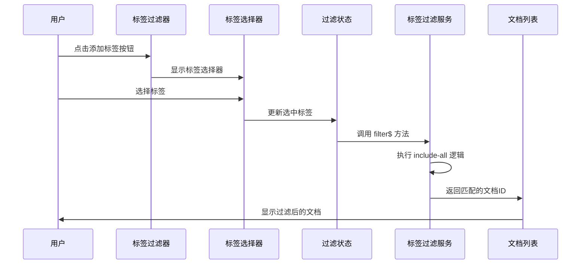
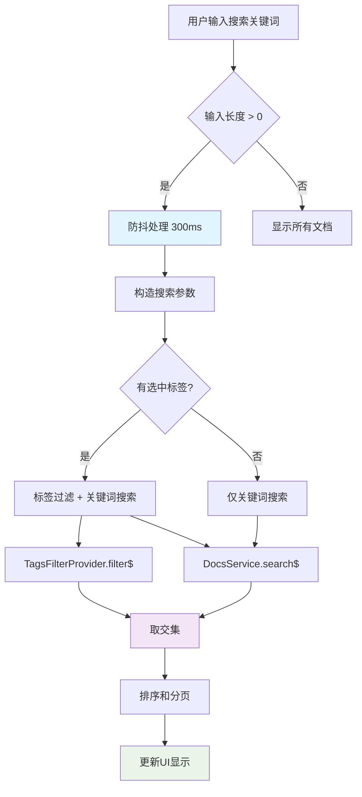
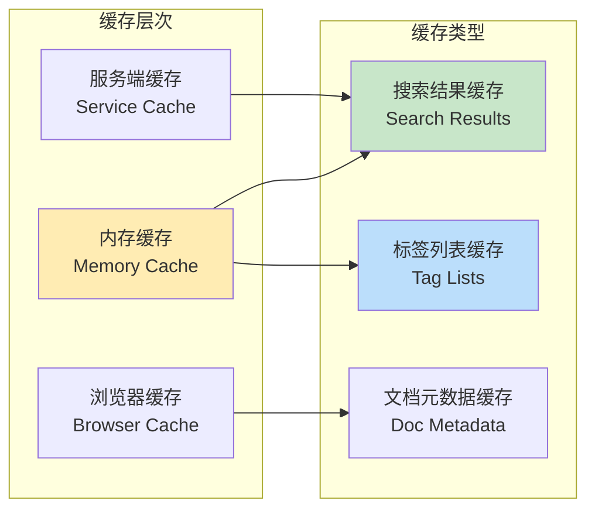

# 数据流设计文档

## 🌊 数据流概览

多标签 AND 逻辑搜索功能的数据流设计基于 RxJS 和现有的服务架构，确保响应式、高性能的用户体验。

---

## 📊 架构图



---

## 🔄 详细数据流

### 1. 标签选择数据流

#### 用户选择标签流程


#### 数据结构转换
```typescript
// 1. 用户选择 → 内部状态
interface UserSelection {
  action: 'add' | 'remove';
  tag: Tag;
}

// 2. 内部状态 → 过滤参数
interface FilterParams {
  method: 'include-all';
  value: string; // "tagId1,tagId2,tagId3"
}

// 3. 过滤参数 → 查询结果
type FilterResult = Observable<Set<string>>; // 文档ID集合

// 4. 查询结果 → 显示数据
interface DisplayDocument {
  id: string;
  title: string;
  excerpt: string;
  tags: Tag[];
  updatedAt: string;
}
```

### 2. 实时搜索数据流

#### 搜索处理流程


### 3. 缓存策略数据流

#### 多层缓存架构


---

## 🔧 状态管理设计

### 1. FilterState 状态机

```typescript
interface FilterState {
  // 标签过滤状态
  selectedTags: Tag[];
  tagFilterMode: 'and' | 'or';
  
  // 搜索状态
  keyword: string;
  isSearching: boolean;
  
  // 结果状态
  results: DocumentSearchResult[];
  totalCount: number;
  
  // UI 状态
  showTagSelector: boolean;
  loading: boolean;
  error: string | null;
}

// 状态转换函数
type FilterAction = 
  | { type: 'ADD_TAG'; tag: Tag }
  | { type: 'REMOVE_TAG'; tagId: string }
  | { type: 'SET_KEYWORD'; keyword: string }
  | { type: 'SET_LOADING'; loading: boolean }
  | { type: 'SET_RESULTS'; results: DocumentSearchResult[] }
  | { type: 'SET_ERROR'; error: string }
  | { type: 'TOGGLE_TAG_SELECTOR' }
  | { type: 'CLEAR_FILTERS' };

function filterReducer(state: FilterState, action: FilterAction): FilterState {
  switch (action.type) {
    case 'ADD_TAG':
      return {
        ...state,
        selectedTags: [...state.selectedTags, action.tag],
        showTagSelector: false
      };
    
    case 'REMOVE_TAG':
      return {
        ...state,
        selectedTags: state.selectedTags.filter(tag => tag.id !== action.tagId)
      };
    
    case 'SET_KEYWORD':
      return {
        ...state,
        keyword: action.keyword,
        isSearching: action.keyword.length > 0
      };
    
    // ... 其他状态转换
    
    default:
      return state;
  }
}
```

### 2. 响应式数据流

#### 使用 RxJS 的响应式架构
```typescript
class MultiTagSearchStore {
  // 私有状态流
  private _filterState$ = new BehaviorSubject<FilterState>(initialState);
  private _searchResults$ = new BehaviorSubject<DocumentSearchResult[]>([]);
  
  // 公开的状态流
  readonly filterState$ = this._filterState$.asObservable();
  readonly searchResults$ = this._searchResults$.asObservable();
  
  // 派生状态流
  readonly selectedTags$ = this.filterState$.pipe(
    map(state => state.selectedTags),
    distinctUntilChanged()
  );
  
  readonly isLoading$ = this.filterState$.pipe(
    map(state => state.loading),
    distinctUntilChanged()
  );
  
  readonly hasFilters$ = this.filterState$.pipe(
    map(state => state.selectedTags.length > 0 || state.keyword.length > 0),
    distinctUntilChanged()
  );
  
  // 搜索触发器
  readonly searchTrigger$ = combineLatest([
    this.selectedTags$,
    this.filterState$.pipe(
      map(state => state.keyword),
      debounceTime(300),
      distinctUntilChanged()
    )
  ]).pipe(
    switchMap(([selectedTags, keyword]) => 
      this.performSearch(selectedTags, keyword)
    )
  );
  
  constructor(
    private tagsFilterProvider: TagsFilterProvider,
    private docsService: DocsService
  ) {
    // 订阅搜索触发器
    this.searchTrigger$.subscribe(results => {
      this._searchResults$.next(results);
      this.updateState({ loading: false, results });
    });
  }
  
  // 状态更新方法
  updateState(partialState: Partial<FilterState>) {
    const currentState = this._filterState$.value;
    this._filterState$.next({ ...currentState, ...partialState });
  }
  
  // 执行搜索
  private async performSearch(
    selectedTags: Tag[], 
    keyword: string
  ): Promise<DocumentSearchResult[]> {
    this.updateState({ loading: true });
    
    try {
      if (selectedTags.length === 0 && keyword.length === 0) {
        // 无过滤条件，返回所有文档
        return await this.docsService.getAllDocuments();
      }
      
      let results: string[] = [];
      
      if (selectedTags.length > 0) {
        // 标签过滤
        const tagFilterParams: FilterParams = {
          method: 'include-all',
          value: selectedTags.map(tag => tag.id).join(',')
        };
        
        const tagFilteredIds = await firstValueFrom(
          this.tagsFilterProvider.filter$(tagFilterParams)
        );
        
        results = Array.from(tagFilteredIds);
      }
      
      if (keyword.length > 0) {
        // 关键词搜索
        const keywordResults = await this.docsService.searchByKeyword(keyword);
        
        if (results.length > 0) {
          // 取交集
          const keywordIds = new Set(keywordResults.map(r => r.id));
          results = results.filter(id => keywordIds.has(id));
        } else {
          results = keywordResults.map(r => r.id);
        }
      }
      
      // 获取完整文档信息
      return await this.docsService.getDocumentsByIds(results);
      
    } catch (error) {
      this.updateState({ error: error.message, loading: false });
      return [];
    }
  }
}
```

---

## ⚡ 性能优化策略

### 1. 虚拟化滚动

```typescript
interface VirtualScrollConfig {
  // 容器高度
  containerHeight: number;
  
  // 单项高度
  itemHeight: number;
  
  // 缓冲区大小
  overscan: number;
  
  // 数据总数
  totalCount: number;
}

class VirtualScrollManager {
  private startIndex = 0;
  private endIndex = 0;
  
  calculateVisibleRange(scrollTop: number, config: VirtualScrollConfig) {
    const { containerHeight, itemHeight, overscan, totalCount } = config;
    
    const visibleStartIndex = Math.floor(scrollTop / itemHeight);
    const visibleEndIndex = Math.min(
      totalCount - 1,
      Math.ceil((scrollTop + containerHeight) / itemHeight)
    );
    
    this.startIndex = Math.max(0, visibleStartIndex - overscan);
    this.endIndex = Math.min(totalCount - 1, visibleEndIndex + overscan);
    
    return {
      startIndex: this.startIndex,
      endIndex: this.endIndex,
      offsetY: this.startIndex * itemHeight
    };
  }
}
```

### 2. 智能缓存策略

```typescript
class SearchCache {
  private tagFilterCache = new Map<string, Set<string>>();
  private searchResultCache = new Map<string, DocumentSearchResult[]>();
  private cacheTimestamps = new Map<string, number>();
  
  // 缓存过期时间 (5分钟)
  private readonly CACHE_EXPIRY_MS = 5 * 60 * 1000;
  
  getCacheKey(tagIds: string[], keyword: string): string {
    const sortedTagIds = [...tagIds].sort().join(',');
    return `${sortedTagIds}:${keyword}`;
  }
  
  getTagFilterResult(tagIds: string[]): Set<string> | null {
    const key = this.getCacheKey(tagIds, '');
    
    if (this.isExpired(key)) {
      this.tagFilterCache.delete(key);
      this.cacheTimestamps.delete(key);
      return null;
    }
    
    return this.tagFilterCache.get(key) || null;
  }
  
  setTagFilterResult(tagIds: string[], result: Set<string>) {
    const key = this.getCacheKey(tagIds, '');
    this.tagFilterCache.set(key, result);
    this.cacheTimestamps.set(key, Date.now());
  }
  
  getSearchResult(tagIds: string[], keyword: string): DocumentSearchResult[] | null {
    const key = this.getCacheKey(tagIds, keyword);
    
    if (this.isExpired(key)) {
      this.searchResultCache.delete(key);
      this.cacheTimestamps.delete(key);
      return null;
    }
    
    return this.searchResultCache.get(key) || null;
  }
  
  setSearchResult(tagIds: string[], keyword: string, result: DocumentSearchResult[]) {
    const key = this.getCacheKey(tagIds, keyword);
    this.searchResultCache.set(key, result);
    this.cacheTimestamps.set(key, Date.now());
  }
  
  private isExpired(key: string): boolean {
    const timestamp = this.cacheTimestamps.get(key);
    if (!timestamp) return true;
    
    return Date.now() - timestamp > this.CACHE_EXPIRY_MS;
  }
  
  // 清理过期缓存
  cleanup() {
    const now = Date.now();
    
    for (const [key, timestamp] of this.cacheTimestamps.entries()) {
      if (now - timestamp > this.CACHE_EXPIRY_MS) {
        this.tagFilterCache.delete(key);
        this.searchResultCache.delete(key);
        this.cacheTimestamps.delete(key);
      }
    }
  }
}
```

### 3. 防抖和节流

```typescript
class SearchDebouncer {
  private searchTimer: NodeJS.Timeout | null = null;
  private lastSearchTime = 0;
  
  // 搜索防抖
  debounceSearch(
    searchFn: () => Promise<void>,
    delay: number = 300
  ): Promise<void> {
    return new Promise((resolve) => {
      if (this.searchTimer) {
        clearTimeout(this.searchTimer);
      }
      
      this.searchTimer = setTimeout(async () => {
        this.lastSearchTime = Date.now();
        await searchFn();
        resolve();
      }, delay);
    });
  }
  
  // 结果更新节流
  throttleUpdate(
    updateFn: () => void,
    interval: number = 100
  ): void {
    const now = Date.now();
    
    if (now - this.lastSearchTime >= interval) {
      updateFn();
      this.lastSearchTime = now;
    }
  }
}
```

---

## 🔄 错误处理和重试

### 错误处理策略

```typescript
class ErrorHandler {
  // 错误类型定义
  static readonly ERROR_TYPES = {
    NETWORK_ERROR: 'network_error',
    SEARCH_TIMEOUT: 'search_timeout',
    INVALID_TAGS: 'invalid_tags',
    PERMISSION_DENIED: 'permission_denied',
    UNKNOWN_ERROR: 'unknown_error'
  } as const;
  
  // 处理搜索错误
  handleSearchError(error: Error, context: SearchContext): ErrorResult {
    if (error.name === 'AbortError') {
      // 搜索被取消，不视为错误
      return { type: 'cancelled', message: null };
    }
    
    if (error.message.includes('network')) {
      return {
        type: ErrorHandler.ERROR_TYPES.NETWORK_ERROR,
        message: '网络连接失败，请检查网络设置',
        retryable: true
      };
    }
    
    if (error.message.includes('timeout')) {
      return {
        type: ErrorHandler.ERROR_TYPES.SEARCH_TIMEOUT,
        message: '搜索超时，请尝试简化搜索条件',
        retryable: true
      };
    }
    
    return {
      type: ErrorHandler.ERROR_TYPES.UNKNOWN_ERROR,
      message: '搜索失败，请稍后重试',
      retryable: true
    };
  }
  
  // 自动重试逻辑
  async withRetry<T>(
    operation: () => Promise<T>,
    maxAttempts: number = 3,
    delay: number = 1000
  ): Promise<T> {
    let lastError: Error;
    
    for (let attempt = 1; attempt <= maxAttempts; attempt++) {
      try {
        return await operation();
      } catch (error) {
        lastError = error as Error;
        
        if (attempt < maxAttempts) {
          await this.sleep(delay * attempt); // 指数退避
        }
      }
    }
    
    throw lastError!;
  }
  
  private sleep(ms: number): Promise<void> {
    return new Promise(resolve => setTimeout(resolve, ms));
  }
}

interface ErrorResult {
  type: string;
  message: string | null;
  retryable?: boolean;
}

interface SearchContext {
  selectedTags: Tag[];
  keyword: string;
  timestamp: number;
}
```

---

## 📈 监控和分析

### 性能指标收集

```typescript
class PerformanceMonitor {
  private metrics = new Map<string, number[]>();
  
  // 记录搜索性能
  measureSearch<T>(
    operation: () => Promise<T>,
    searchContext: SearchContext
  ): Promise<T> {
    const startTime = performance.now();
    
    return operation().finally(() => {
      const duration = performance.now() - startTime;
      this.recordMetric('search_duration', duration);
      
      // 记录上下文相关指标
      this.recordMetric('tag_count', searchContext.selectedTags.length);
      this.recordMetric('keyword_length', searchContext.keyword.length);
    });
  }
  
  // 记录用户行为
  recordUserAction(action: string, context?: any) {
    const timestamp = Date.now();
    
    // 发送到分析服务
    this.sendAnalytics({
      event: 'user_action',
      action,
      context,
      timestamp
    });
  }
  
  private recordMetric(name: string, value: number) {
    if (!this.metrics.has(name)) {
      this.metrics.set(name, []);
    }
    
    const values = this.metrics.get(name)!;
    values.push(value);
    
    // 保持最近100个数据点
    if (values.length > 100) {
      values.shift();
    }
  }
  
  // 获取性能统计
  getStats(metricName: string) {
    const values = this.metrics.get(metricName) || [];
    
    if (values.length === 0) {
      return null;
    }
    
    const sorted = [...values].sort((a, b) => a - b);
    
    return {
      count: values.length,
      min: sorted[0],
      max: sorted[sorted.length - 1],
      avg: values.reduce((sum, v) => sum + v, 0) / values.length,
      p50: sorted[Math.floor(sorted.length * 0.5)],
      p95: sorted[Math.floor(sorted.length * 0.95)]
    };
  }
  
  private sendAnalytics(data: any) {
    // 发送到分析服务 (如 Google Analytics, Mixpanel 等)
    if (typeof window !== 'undefined' && window.gtag) {
      window.gtag('event', data.action, {
        event_category: 'search',
        value: data.context
      });
    }
  }
}
```

---

**文档版本**: v1.0  
**创建时间**: 2025-01-25  
**数据架构师**: 开发团队