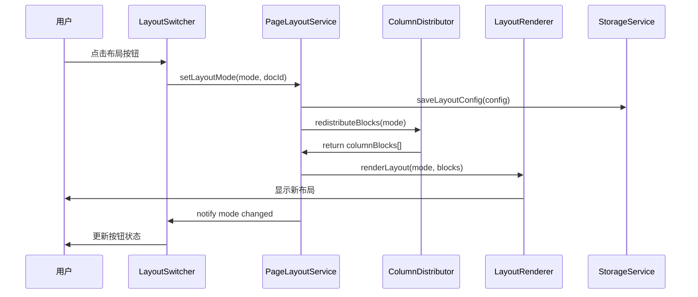

# BlockSuite 列布局系统架构设计文档

## 🏗️ 系统架构概览

### 1. 分层架构设计

```
┌─────────────────────────────────────────────────────────────┐
│                    Presentation Layer                       │
│  ┌─────────────────┐  ┌─────────────────┐  ┌──────────────┐ │
│  │  LayoutSwitcher │  │ LayoutRenderer  │  │ ColumnContent│ │
│  │   (切换器)       │  │   (渲染器)      │  │   (列内容)   │ │
│  └─────────────────┘  └─────────────────┘  └──────────────┘ │
└─────────────────────────────────────────────────────────────┘
            │                    │                    │
            ▼                    ▼                    ▼
┌─────────────────────────────────────────────────────────────┐
│                     Service Layer                           │
│  ┌─────────────────┐  ┌─────────────────┐  ┌──────────────┐ │
│  │ PageLayoutService│  │ColumnDistributor│  │StorageService│ │
│  │  (状态管理)      │  │  (内容分配)     │  │  (持久化)    │ │
│  └─────────────────┘  └─────────────────┘  └──────────────┘ │
└─────────────────────────────────────────────────────────────┘
            │                    │                    │
            ▼                    ▼                    ▼
┌─────────────────────────────────────────────────────────────┐
│                      Data Layer                             │
│  ┌─────────────────┐  ┌─────────────────┐  ┌──────────────┐ │
│  │  LayoutConfig   │  │  ColumnData     │  │  BlockData   │ │
│  │   (布局配置)     │  │   (列数据)      │  │  (块数据)    │ │
│  └─────────────────┘  └─────────────────┘  └──────────────┘ │
└─────────────────────────────────────────────────────────────┘
```

### 2. 核心模块职责

#### 🎛️ Presentation Layer (表示层)
- **LayoutSwitcher**: 用户交互界面，处理布局模式切换
- **LayoutRenderer**: 负责根据模式渲染对应的布局结构
- **ColumnContent**: 单列内容的渲染和交互管理

#### ⚙️ Service Layer (服务层)
- **PageLayoutService**: 布局状态的统一管理和协调
- **ColumnDistributor**: 智能内容分配算法实现
- **StorageService**: 布局配置的持久化存储

#### 💾 Data Layer (数据层)
- **LayoutConfig**: 布局配置数据结构
- **ColumnData**: 列相关的数据模型
- **BlockData**: Block数据的扩展接口

## 🔄 数据流设计

### 1. 用户交互流程



### 2. 数据流向图

```
┌─────────────┐    setLayoutMode()    ┌──────────────────┐
│ User Action │ ─────────────────────▶ │ PageLayoutService│
└─────────────┘                       └──────────────────┘
                                               │
                                               ▼
                                      ┌──────────────────┐
                                      │ ColumnDistributor│
                                      └──────────────────┘
                                               │
                                               ▼
                                      ┌──────────────────┐
                                      │  LayoutRenderer  │
                                      └──────────────────┘
                                               │
                                               ▼
                                      ┌──────────────────┐
                                      │   DOM Update     │
                                      └──────────────────┘
```

## 🧩 核心组件设计

### 1. PageLayoutService (状态管理核心)

```typescript
/**
 * 页面布局服务 - 系统的状态管理中心
 * 
 * 职责:
 * - 管理当前布局模式
 * - 协调各个服务模块
 * - 处理布局变化事件
 * - 提供布局相关的计算服务
 */
export class PageLayoutService {
  // === 状态管理 ===
  private _layoutMode$ = signal<PageLayoutMode>(PageLayoutMode.Normal);
  private _columnWidths$ = signal<number[]>([1, 1, 1, 1, 1]);
  private _isTransitioning$ = signal<boolean>(false);
  
  // === 依赖服务 ===
  private distributor = new ColumnDistributor();
  private storage = new StorageService();
  private responsive = new ResponsiveManager();
  
  // === 计算属性 ===
  readonly currentMode$ = computed(() => this._layoutMode$.value);
  readonly columnCount$ = computed(() => 
    LayoutModeConfig[this._layoutMode$.value].columns
  );
  readonly effectiveMode$ = computed(() => 
    this.responsive.getEffectiveMode(this._layoutMode$.value)
  );
  
  // === 公共方法 ===
  async setLayoutMode(mode: PageLayoutMode, docId: string): Promise<void> {
    if (this._isTransitioning$.value) return;
    
    this._isTransitioning$.value = true;
    
    try {
      // 1. 触发切换前事件
      this._emitBeforeChange(this._layoutMode$.value, mode);
      
      // 2. 更新状态
      this._layoutMode$.value = mode;
      
      // 3. 保存配置
      await this.storage.saveLayoutConfig(docId, {
        layoutMode: mode,
        columnWidths: this._columnWidths$.value,
        timestamp: Date.now()
      });
      
      // 4. 触发切换后事件
      this._emitAfterChange(mode);
      
    } finally {
      this._isTransitioning$.value = false;
    }
  }
  
  distributeContent(blocks: Block[]): Block[][] {
    return this.distributor.distributeBlocks(
      blocks, 
      this.columnCount$.value
    );
  }
  
  // === 事件系统 ===
  onLayoutModeChange(): Observable<LayoutModeChangeEvent> {
    return this.layoutModeChange$;
  }
  
  onLayoutError(): Observable<LayoutError> {
    return this.layoutError$;
  }
}
```

### 2. ColumnDistributor (内容分配器)

```typescript
/**
 * 列内容分配器 - 智能内容分配算法
 * 
 * 职责:
 * - 实现多种分配策略
 * - 优化内容在各列间的平衡
 * - 处理特殊Block的分配逻辑
 * - 支持自定义分配规则
 */
export class ColumnDistributor {
  private strategies = new Map<DistributionStrategy, DistributionAlgorithm>();
  
  constructor() {
    this.registerStrategy('round-robin', new RoundRobinDistribution());
    this.registerStrategy('balanced-height', new BalancedHeightDistribution());
    this.registerStrategy('content-aware', new ContentAwareDistribution());
  }
  
  distributeBlocks(
    blocks: Block[], 
    columnCount: number,
    strategy: DistributionStrategy = 'balanced-height'
  ): Block[][] {
    if (columnCount === 1) {
      return [blocks];
    }
    
    const algorithm = this.strategies.get(strategy);
    if (!algorithm) {
      throw new Error(`Unknown distribution strategy: ${strategy}`);
    }
    
    return algorithm.distribute(blocks, columnCount);
  }
  
  redistributeOnModeChange(
    currentColumns: Block[][],
    newColumnCount: number
  ): Block[][] {
    // 合并所有列的内容
    const allBlocks = currentColumns.flat();
    
    // 重新分配
    return this.distributeBlocks(allBlocks, newColumnCount);
  }
}

/**
 * 平衡高度分配算法
 */
class BalancedHeightDistribution implements DistributionAlgorithm {
  distribute(blocks: Block[], columnCount: number): Block[][] {
    const columns: Block[][] = Array.from({length: columnCount}, () => []);
    const columnHeights: number[] = Array(columnCount).fill(0);
    
    // 按Block估算高度排序 (大的优先)
    const sortedBlocks = this.sortByEstimatedHeight(blocks);
    
    for (const block of sortedBlocks) {
      // 找到当前高度最小的列
      const minHeightIndex = this.findMinHeightColumn(columnHeights);
      
      columns[minHeightIndex].push(block);
      columnHeights[minHeightIndex] += this.estimateBlockHeight(block);
    }
    
    return columns;
  }
  
  private estimateBlockHeight(block: Block): number {
    const heightMap: Record<string, number> = {
      'affine:paragraph': this.estimateParagraphHeight(block),
      'affine:image': 250,
      'affine:database': 300,
      'affine:list': this.estimateListHeight(block),
      'affine:callout': 120,
      'affine:code': this.estimateCodeHeight(block),
    };
    
    return heightMap[block.flavour] || 80;
  }
  
  private estimateParagraphHeight(block: Block): number {
    const text = block.text?.toString() || '';
    const lineHeight = 24;
    const charsPerLine = 60;
    const lines = Math.ceil(text.length / charsPerLine);
    return Math.max(lines * lineHeight, 50);
  }
}
```

### 3. LayoutRenderer (布局渲染器)

```typescript
/**
 * 布局渲染器 - 负责UI渲染逻辑
 * 
 * 职责:
 * - 根据布局模式渲染UI结构
 * - 管理布局切换动画
 * - 处理响应式布局适配
 * - 优化渲染性能
 */
export class LayoutRenderer {
  private animationManager = new AnimationManager();
  private viewportManager = new ViewportManager();
  
  async renderLayout(
    mode: PageLayoutMode,
    blocks: Block[],
    container: HTMLElement
  ): Promise<void> {
    // 1. 准备渲染数据
    const columnData = this.prepareColumnData(mode, blocks);
    
    // 2. 创建布局容器
    const layoutContainer = this.createLayoutContainer(mode);
    
    // 3. 渲染各列内容
    const columnElements = await this.renderColumns(columnData);
    
    // 4. 执行布局切换动画
    await this.animationManager.transitionToLayout(
      container,
      layoutContainer,
      columnElements
    );
    
    // 5. 设置响应式监听
    this.viewportManager.setupResponsiveListeners(layoutContainer);
  }
  
  private createLayoutContainer(mode: PageLayoutMode): HTMLElement {
    const container = document.createElement('div');
    container.className = `column-layout-container layout-${mode}`;
    
    // 设置CSS Grid属性
    const columnCount = LayoutModeConfig[mode].columns;
    container.style.gridTemplateColumns = `repeat(${columnCount}, 1fr)`;
    
    return container;
  }
  
  private async renderColumns(columnData: ColumnData[]): Promise<HTMLElement[]> {
    const columnElements: HTMLElement[] = [];
    
    for (const [index, data] of columnData.entries()) {
      const columnEl = await this.renderSingleColumn(index, data);
      columnElements.push(columnEl);
    }
    
    return columnElements;
  }
  
  private async renderSingleColumn(
    index: number,
    data: ColumnData
  ): Promise<HTMLElement> {
    const column = document.createElement('div');
    column.className = 'column-content';
    column.setAttribute('data-column-index', index.toString());
    
    // 渲染列头 (可选)
    if (data.showHeader) {
      column.appendChild(this.createColumnHeader(index));
    }
    
    // 渲染Block内容
    const contentContainer = this.createContentContainer();
    for (const block of data.blocks) {
      const blockElement = await this.renderBlock(block);
      contentContainer.appendChild(blockElement);
    }
    column.appendChild(contentContainer);
    
    // 渲染添加按钮
    column.appendChild(this.createAddButton(index));
    
    return column;
  }
}
```

### 4. StorageService (存储服务)

```typescript
/**
 * 存储服务 - 布局配置持久化
 * 
 * 职责:
 * - 本地存储管理
 * - 云端同步 (可选)
 * - 配置缓存
 * - 数据迁移
 */
export class StorageService {
  private cache = new Map<string, DocLayoutConfig>();
  private syncManager?: CloudSyncManager;
  
  async saveLayoutConfig(docId: string, config: Partial<DocLayoutConfig>): Promise<void> {
    const fullConfig: DocLayoutConfig = {
      docId,
      layoutMode: PageLayoutMode.Normal,
      columnWidths: [1, 1, 1, 1, 1],
      responsive: true,
      lastModified: Date.now(),
      ...config
    };
    
    // 更新缓存
    this.cache.set(docId, fullConfig);
    
    // 保存到localStorage
    try {
      localStorage.setItem(
        this.getStorageKey(docId),
        JSON.stringify(fullConfig)
      );
    } catch (error) {
      console.warn('Failed to save layout config to localStorage:', error);
    }
    
    // 云端同步 (如果启用)
    if (this.syncManager) {
      await this.syncManager.uploadConfig(fullConfig);
    }
  }
  
  async loadLayoutConfig(docId: string): Promise<DocLayoutConfig | null> {
    // 首先检查缓存
    if (this.cache.has(docId)) {
      return this.cache.get(docId)!;
    }
    
    // 从localStorage加载
    try {
      const stored = localStorage.getItem(this.getStorageKey(docId));
      if (stored) {
        const config = JSON.parse(stored) as DocLayoutConfig;
        this.cache.set(docId, config);
        return config;
      }
    } catch (error) {
      console.warn('Failed to load layout config from localStorage:', error);
    }
    
    // 云端加载 (如果启用)
    if (this.syncManager) {
      const cloudConfig = await this.syncManager.downloadConfig(docId);
      if (cloudConfig) {
        this.cache.set(docId, cloudConfig);
        return cloudConfig;
      }
    }
    
    return null;
  }
  
  async clearLayoutConfig(docId: string): Promise<void> {
    this.cache.delete(docId);
    localStorage.removeItem(this.getStorageKey(docId));
    
    if (this.syncManager) {
      await this.syncManager.deleteConfig(docId);
    }
  }
  
  private getStorageKey(docId: string): string {
    return `blocksuite-layout-${docId}`;
  }
}
```

## 🎨 UI组件架构

### 1. LayoutSwitcher (布局切换器)

```typescript
/**
 * 布局切换器 - 用户交互的主要入口
 */
@customElement('layout-switcher')
export class LayoutSwitcher extends LitElement {
  @property() docId!: string;
  @property() currentMode: PageLayoutMode = PageLayoutMode.Normal;
  @property() disabled = false;
  
  @state() private isLoading = false;
  
  private layoutService!: PageLayoutService;
  
  static styles = css`
    :host {
      display: flex;
      align-items: center;
      gap: 8px;
      padding: 8px 12px;
      background: var(--affine-background-secondary-color);
      border-radius: 8px;
      border: 1px solid var(--affine-border-color);
    }
    
    .layout-button {
      display: flex;
      align-items: center;
      justify-content: center;
      width: 32px;
      height: 32px;
      border: none;
      border-radius: 6px;
      background: transparent;
      cursor: pointer;
      transition: all 0.2s ease;
      color: var(--affine-icon-color);
    }
    
    .layout-button:hover {
      background: var(--affine-hover-color);
      color: var(--affine-primary-color);
    }
    
    .layout-button.active {
      background: var(--affine-primary-color);
      color: white;
    }
    
    .layout-button:disabled {
      opacity: 0.5;
      cursor: not-allowed;
    }
  `;
  
  render() {
    return html`
      <div class="layout-switcher-container">
        ${Object.values(PageLayoutMode).map(mode => 
          this.renderModeButton(mode)
        )}
      </div>
    `;
  }
  
  private renderModeButton(mode: PageLayoutMode) {
    const config = LayoutModeConfig[mode];
    const isActive = this.currentMode === mode;
    
    return html`
      <button
        class="layout-button ${isActive ? 'active' : ''}"
        ?disabled=${this.disabled || this.isLoading}
        title=${config.label}
        @click=${() => this.switchToMode(mode)}
      >
        ${this.renderModeIcon(mode)}
      </button>
    `;
  }
  
  private renderModeIcon(mode: PageLayoutMode) {
    const config = LayoutModeConfig[mode];
    return html`<span class="layout-icon">${config.icon}</span>`;
  }
  
  private async switchToMode(mode: PageLayoutMode) {
    if (mode === this.currentMode || this.isLoading) return;
    
    this.isLoading = true;
    
    try {
      await this.layoutService.setLayoutMode(mode, this.docId);
      this.currentMode = mode;
      
      // 触发自定义事件
      this.dispatchEvent(new CustomEvent('layout-mode-changed', {
        detail: { mode, docId: this.docId },
        bubbles: true
      }));
      
    } catch (error) {
      console.error('Failed to switch layout mode:', error);
      
      // 显示错误提示
      this.dispatchEvent(new CustomEvent('layout-error', {
        detail: { error, mode },
        bubbles: true
      }));
      
    } finally {
      this.isLoading = false;
    }
  }
}
```

### 2. ColumnContent (列内容组件)

```typescript
/**
 * 列内容组件 - 单列的内容管理
 */
@customElement('column-content')
export class ColumnContent extends LitElement {
  @property() columnIndex!: number;
  @property() blocks: Block[] = [];
  @property() readonly = false;
  
  @state() private isDragOver = false;
  @state() private isAddingContent = false;
  
  static styles = css`
    :host {
      display: flex;
      flex-direction: column;
      min-height: 200px;
      padding: 16px;
      border-radius: 8px;
      border: 2px dashed var(--affine-border-color);
      transition: all 0.3s ease;
    }
    
    :host(.drag-over) {
      border-color: var(--affine-primary-color);
      background: var(--affine-hover-color);
    }
    
    .column-header {
      display: flex;
      align-items: center;
      justify-content: space-between;
      margin-bottom: 12px;
      padding-bottom: 8px;
      border-bottom: 1px solid var(--affine-border-color);
    }
    
    .column-title {
      font-size: 14px;
      font-weight: 500;
      color: var(--affine-text-secondary-color);
    }
    
    .block-container {
      flex: 1;
      display: flex;
      flex-direction: column;
      gap: 8px;
    }
    
    .add-content-button {
      display: flex;
      align-items: center;
      justify-content: center;
      padding: 12px;
      margin-top: 16px;
      border: 1px dashed var(--affine-border-color);
      border-radius: 6px;
      background: transparent;
      cursor: pointer;
      color: var(--affine-text-secondary-color);
      transition: all 0.2s ease;
    }
    
    .add-content-button:hover {
      border-color: var(--affine-primary-color);
      color: var(--affine-primary-color);
      background: var(--affine-hover-color);
    }
  `;
  
  render() {
    return html`
      <div class="column-header">
        <span class="column-title">第 ${this.columnIndex + 1} 列</span>
        <column-actions .columnIndex=${this.columnIndex}></column-actions>
      </div>
      
      <div class="block-container" @drop=${this.onDrop} @dragover=${this.onDragOver}>
        ${this.blocks.map(block => this.renderBlock(block))}
      </div>
      
      ${!this.readonly ? html`
        <button class="add-content-button" @click=${this.openAddMenu}>
          <plus-icon></plus-icon>
          <span>添加内容</span>
        </button>
      ` : ''}
    `;
  }
  
  private renderBlock(block: Block) {
    // 使用BlockSuite的标准Block渲染机制
    return html`<block-element .block=${block}></block-element>`;
  }
  
  private onDragOver(e: DragEvent) {
    e.preventDefault();
    this.isDragOver = true;
    this.classList.add('drag-over');
  }
  
  private onDrop(e: DragEvent) {
    e.preventDefault();
    this.isDragOver = false;
    this.classList.remove('drag-over');
    
    // 处理Block拖拽逻辑
    const blockData = e.dataTransfer?.getData('application/block');
    if (blockData) {
      this.handleBlockDrop(JSON.parse(blockData));
    }
  }
  
  private async openAddMenu() {
    if (this.readonly) return;
    
    this.isAddingContent = true;
    
    // 显示BlockSuite的slash menu
    const event = new CustomEvent('show-slash-menu', {
      detail: {
        columnIndex: this.columnIndex,
        position: this.getBoundingClientRect()
      },
      bubbles: true
    });
    
    this.dispatchEvent(event);
  }
}
```

## 🎭 动画系统设计

### 1. AnimationManager (动画管理器)

```typescript
/**
 * 动画管理器 - 统一管理布局切换动画
 */
export class AnimationManager {
  private animationQueue: Animation[] = [];
  private isAnimating = false;
  
  async transitionToLayout(
    oldContainer: HTMLElement,
    newContainer: HTMLElement,
    newColumns: HTMLElement[]
  ): Promise<void> {
    if (this.isAnimating) {
      await this.waitForAnimationComplete();
    }
    
    this.isAnimating = true;
    
    try {
      // 1. 淡出旧布局
      await this.fadeOut(oldContainer);
      
      // 2. 替换容器
      oldContainer.parentNode?.replaceChild(newContainer, oldContainer);
      
      // 3. 淡入新布局
      await this.fadeInColumns(newColumns);
      
    } finally {
      this.isAnimating = false;
    }
  }
  
  private async fadeOut(element: HTMLElement): Promise<void> {
    return new Promise(resolve => {
      const animation = element.animate([
        { opacity: 1, transform: 'scale(1)' },
        { opacity: 0, transform: 'scale(0.95)' }
      ], {
        duration: 200,
        easing: 'cubic-bezier(0.4, 0, 0.2, 1)'
      });
      
      animation.onfinish = () => resolve();
      this.animationQueue.push(animation);
    });
  }
  
  private async fadeInColumns(columns: HTMLElement[]): Promise<void> {
    // 设置初始状态
    columns.forEach(column => {
      column.style.opacity = '0';
      column.style.transform = 'translateY(20px)';
    });
    
    // 依次淡入各列
    const animations = columns.map((column, index) => {
      return new Promise<void>(resolve => {
        setTimeout(() => {
          const animation = column.animate([
            { opacity: 0, transform: 'translateY(20px)' },
            { opacity: 1, transform: 'translateY(0)' }
          ], {
            duration: 300,
            easing: 'cubic-bezier(0.4, 0, 0.2, 1)',
            fill: 'forwards'
          });
          
          animation.onfinish = () => resolve();
          this.animationQueue.push(animation);
        }, index * 100); // 错开动画时间
      });
    });
    
    await Promise.all(animations);
  }
  
  private async waitForAnimationComplete(): Promise<void> {
    await Promise.all(
      this.animationQueue.map(animation => animation.finished)
    );
    this.animationQueue = [];
  }
}
```

### 2. ResponsiveManager (响应式管理器)

```typescript
/**
 * 响应式管理器 - 处理不同屏幕尺寸的布局适配
 */
export class ResponsiveManager {
  private breakpoints = {
    mobile: 768,
    tablet: 1024,
    desktop: 1440
  };
  
  private observers = new Set<ResizeObserver>();
  
  getEffectiveMode(requestedMode: PageLayoutMode): PageLayoutMode {
    const screenWidth = window.innerWidth;
    const maxColumns = this.getMaxColumnsForWidth(screenWidth);
    const requestedColumns = LayoutModeConfig[requestedMode].columns;
    
    if (requestedColumns <= maxColumns) {
      return requestedMode;
    }
    
    // 降级到支持的最大列数
    return this.getModeByColumnCount(maxColumns);
  }
  
  private getMaxColumnsForWidth(width: number): number {
    if (width < this.breakpoints.mobile) return 1;
    if (width < this.breakpoints.tablet) return 2;
    if (width < this.breakpoints.desktop) return 4;
    return 5;
  }
  
  private getModeByColumnCount(columns: number): PageLayoutMode {
    const modeMap = {
      1: PageLayoutMode.Normal,
      2: PageLayoutMode.TwoColumn,
      3: PageLayoutMode.ThreeColumn,
      4: PageLayoutMode.FourColumn,
      5: PageLayoutMode.FiveColumn
    };
    
    return modeMap[columns as keyof typeof modeMap] || PageLayoutMode.Normal;
  }
  
  setupResponsiveListeners(container: HTMLElement): void {
    // 使用ResizeObserver监听容器尺寸变化
    const observer = new ResizeObserver(entries => {
      for (const entry of entries) {
        this.handleContainerResize(entry);
      }
    });
    
    observer.observe(container);
    this.observers.add(observer);
  }
  
  private handleContainerResize(entry: ResizeObserverEntry): void {
    const { width } = entry.contentRect;
    const container = entry.target as HTMLElement;
    
    // 根据容器宽度调整布局
    this.adjustLayoutForWidth(container, width);
  }
  
  private adjustLayoutForWidth(container: HTMLElement, width: number): void {
    const maxColumns = this.getMaxColumnsForWidth(width);
    const currentColumns = this.getCurrentColumnCount(container);
    
    if (currentColumns > maxColumns) {
      // 需要减少列数
      this.forceColumnReduction(container, maxColumns);
    }
  }
  
  dispose(): void {
    this.observers.forEach(observer => observer.disconnect());
    this.observers.clear();
  }
}
```

## 📊 性能优化架构

### 1. VirtualizationManager (虚拟化管理器)

```typescript
/**
 * 虚拟化管理器 - 处理大量内容的性能优化
 */
export class VirtualizationManager {
  private visibleRange = { start: 0, end: 10 };
  private itemHeight = 80; // 平均Block高度
  private scrollContainer: HTMLElement | null = null;
  
  setupVirtualization(container: HTMLElement, blocks: Block[]): void {
    if (blocks.length < 50) {
      // 内容较少时不启用虚拟化
      return;
    }
    
    this.scrollContainer = container;
    this.setupScrollListener();
    this.calculateVisibleRange();
  }
  
  private setupScrollListener(): void {
    if (!this.scrollContainer) return;
    
    let ticking = false;
    
    const handleScroll = () => {
      if (!ticking) {
        requestAnimationFrame(() => {
          this.calculateVisibleRange();
          ticking = false;
        });
        ticking = true;
      }
    };
    
    this.scrollContainer.addEventListener('scroll', handleScroll, { passive: true });
  }
  
  private calculateVisibleRange(): void {
    if (!this.scrollContainer) return;
    
    const scrollTop = this.scrollContainer.scrollTop;
    const containerHeight = this.scrollContainer.clientHeight;
    
    const start = Math.floor(scrollTop / this.itemHeight);
    const end = Math.ceil((scrollTop + containerHeight) / this.itemHeight);
    
    this.visibleRange = { start, end };
  }
  
  getVisibleBlocks(blocks: Block[]): Block[] {
    return blocks.slice(this.visibleRange.start, this.visibleRange.end);
  }
}
```

### 2. CacheManager (缓存管理器)

```typescript
/**
 * 缓存管理器 - 优化重复计算和渲染
 */
export class CacheManager {
  private layoutCache = new Map<string, CachedLayout>();
  private blockHeightCache = new Map<string, number>();
  private maxCacheSize = 100;
  
  getCachedLayout(key: string): CachedLayout | null {
    const cached = this.layoutCache.get(key);
    
    if (cached && this.isValidCache(cached)) {
      cached.lastAccessed = Date.now();
      return cached;
    }
    
    return null;
  }
  
  setCachedLayout(key: string, layout: CachedLayout): void {
    if (this.layoutCache.size >= this.maxCacheSize) {
      this.evictOldest();
    }
    
    layout.lastAccessed = Date.now();
    this.layoutCache.set(key, layout);
  }
  
  getCachedBlockHeight(blockId: string): number | null {
    return this.blockHeightCache.get(blockId) || null;
  }
  
  setCachedBlockHeight(blockId: string, height: number): void {
    this.blockHeightCache.set(blockId, height);
  }
  
  private isValidCache(cached: CachedLayout): boolean {
    const maxAge = 5 * 60 * 1000; // 5分钟
    return Date.now() - cached.timestamp < maxAge;
  }
  
  private evictOldest(): void {
    let oldestKey = '';
    let oldestTime = Date.now();
    
    for (const [key, value] of this.layoutCache) {
      if (value.lastAccessed < oldestTime) {
        oldestTime = value.lastAccessed;
        oldestKey = key;
      }
    }
    
    if (oldestKey) {
      this.layoutCache.delete(oldestKey);
    }
  }
  
  clear(): void {
    this.layoutCache.clear();
    this.blockHeightCache.clear();
  }
}
```

## 🔌 扩展接口设计

### 1. LayoutExtensionAPI

```typescript
/**
 * 布局扩展API - 允许第三方扩展布局功能
 */
export interface LayoutExtensionAPI {
  // 注册自定义布局模式
  registerLayoutMode(mode: CustomLayoutMode): void;
  
  // 注册自定义分配策略
  registerDistributionStrategy(strategy: DistributionStrategy): void;
  
  // 注册布局事件监听器
  onLayoutChange(listener: LayoutChangeListener): void;
  
  // 获取当前布局状态
  getCurrentLayoutState(): LayoutState;
  
  // 强制重新计算布局
  recalculateLayout(): Promise<void>;
}

/**
 * 自定义布局模式接口
 */
export interface CustomLayoutMode {
  id: string;
  name: string;
  icon: string;
  columns: number;
  renderer: CustomLayoutRenderer;
  constraints?: LayoutConstraints;
}

/**
 * 布局约束接口
 */
export interface LayoutConstraints {
  minWidth?: number;
  maxWidth?: number;
  minColumns?: number;
  maxColumns?: number;
  supportedBlockTypes?: string[];
  responsiveBreakpoints?: ResponsiveBreakpoints;
}
```

### 2. 插件系统

```typescript
/**
 * 布局插件基类
 */
export abstract class LayoutPlugin {
  abstract id: string;
  abstract name: string;
  abstract version: string;
  
  abstract install(api: LayoutExtensionAPI): void;
  abstract uninstall(): void;
  
  // 可选的生命周期钩子
  onLayoutModeChange?(from: PageLayoutMode, to: PageLayoutMode): void;
  onColumnResize?(columnIndex: number, newWidth: number): void;
  onBlockMove?(blockId: string, fromColumn: number, toColumn: number): void;
}

/**
 * 示例插件: 网格布局插件
 */
export class GridLayoutPlugin extends LayoutPlugin {
  id = 'grid-layout';
  name = 'Grid Layout';
  version = '1.0.0';
  
  install(api: LayoutExtensionAPI): void {
    // 注册网格布局模式
    api.registerLayoutMode({
      id: 'grid-2x2',
      name: '2x2网格',
      icon: '⚏',
      columns: 4,
      renderer: new GridLayoutRenderer()
    });
    
    // 监听布局变化
    api.onLayoutChange((event) => {
      if (event.mode === 'grid-2x2') {
        this.setupGridBehavior();
      }
    });
  }
  
  uninstall(): void {
    // 清理资源
  }
  
  private setupGridBehavior(): void {
    // 实现网格特定的行为
  }
}
```

---

**文档版本**: v1.0  
**创建日期**: 2025-07-27  
**最后更新**: 2025-07-27  
**审核状态**: 待审核  