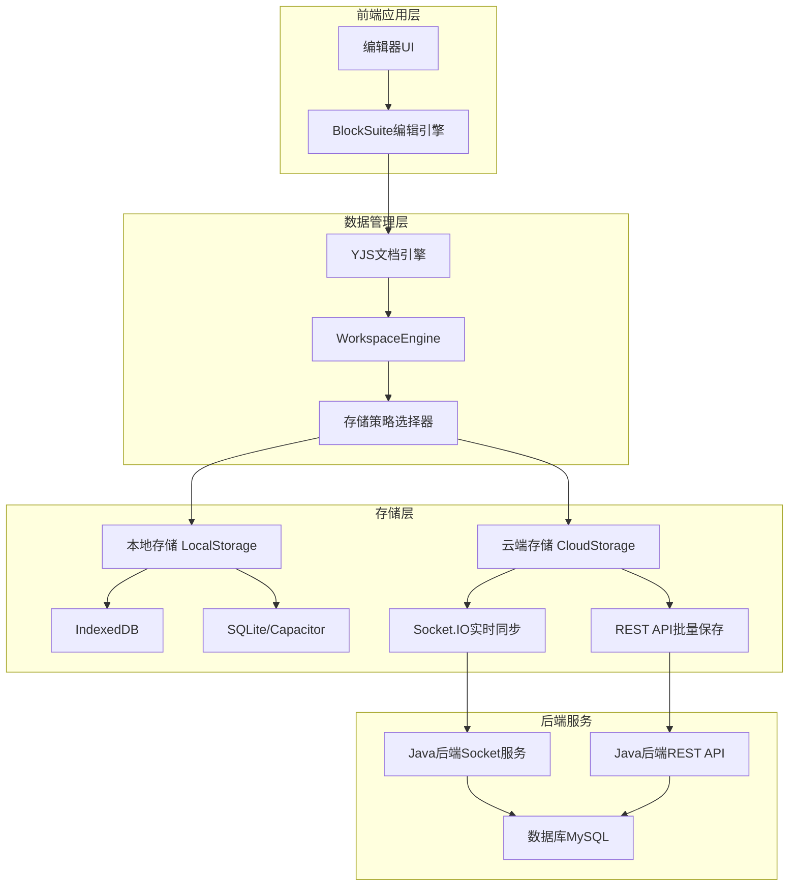

# 前端数据存储与持久化全面分析报告

## 📊 分析概览

- **分析目标**: `/mnt/d/Documents/yunkebaiban/baibanfront`
- **技术栈**: React + TypeScript + YJS + BlockSuite + Socket.IO
- **架构模式**: 双层存储架构 (本地存储 + 云端同步)
- **分析时间**: 基于最新代码分析
- **分析重点**: 离线/联网保存机制、数据持久化流程、后端API集成

---

## 🎯 核心问题分析

### ❓ 用户核心疑问
1. **前端是否区分离线和联网保存？** ✅ 是的，有完整的离线/在线模式切换
2. **联网保存是否走后端接口？** ✅ 是的，通过Socket.IO和REST API双重保存
3. **数据不能持久化的原因？** ⚠️ 发现多个配置和连接问题

---

## 📋 数据存储架构详细分析

### 🏗️ 整体架构



### 🔧 存储引擎配置

#### 1. 双引擎架构

**本地存储引擎** (`local.ts:76-122`):
```typescript
class LocalWorkspaceFlavourProvider {
  // 平台适配存储选择
  DocStorageType = BUILD_CONFIG.isElectron ? SqliteDocStorage : IndexedDBDocStorage;
  BlobStorageType = BUILD_CONFIG.isElectron ? SqliteBlobStorage : IndexedDBBlobStorage;
  
  // Android特殊处理
  DocStorageType = BUILD_CONFIG.isAndroid && window.Capacitor 
    ? IndexedDBDocStorage 
    : SqliteDocStorage;
}
```

**云端存储引擎** (`cloud.ts:186-260`):
```typescript
class CloudWorkspaceFlavourProvider {
  // 动态存储类型选择
  DocStorageType = () => {
    if (BUILD_CONFIG.isAndroid && window.Capacitor) {
      return IndexedDBDocStorage; // 强制使用IndexedDB
    }
    return BUILD_CONFIG.isElectron ? SqliteDocStorage : IndexedDBDocStorage;
  }
}
```

#### 2. 存储层级映射

| 平台环境 | 文档存储 | 二进制存储 | 同步存储 | 备注 |
|----------|----------|------------|----------|------|
| **Web浏览器** | IndexedDBDocStorage | IndexedDBBlobStorage | IndexedDBDocSyncStorage | 标准Web环境 |
| **Electron桌面** | SqliteDocStorage | SqliteBlobStorage | SqliteDocSyncStorage | 原生数据库 |
| **Android App** | IndexedDBDocStorage | IndexedDBBlobStorage | IndexedDBDocSyncStorage | 强制IndexedDB |
| **iOS App** | SqliteDocStorage | SqliteBlobStorage | SqliteDocSyncStorage | 原生SQLite |

---

## 🔄 离线/在线模式实现分析

### ✅ **问题答案：前端确实区分离线和联网保存**

#### 1. 模式检测机制

**网络状态监听** (`cloud-storage-manager.tsx:242-264`):
```typescript
// 网络状态实时监控
useEffect(() => {
  const handleOnline = () => {
    setIsOnline(true);
    if (!isConnected && currentWorkspaceId) {
      reconnectAttempts.current = 0;
      connectToSocket(); // 网络恢复时自动重连
    }
  };

  const handleOffline = () => {
    setIsOnline(false);
    setStorageMode('local'); // 切换到本地模式
  };

  window.addEventListener('online', handleOnline);
  window.addEventListener('offline', handleOffline);
}, [isConnected, currentWorkspaceId]);
```

#### 2. 存储模式切换

**四种存储状态** (`cloud-storage-manager.tsx:49`):
```typescript
storageMode: 'detecting' | 'local' | 'cloud' | 'error'
```

- **`detecting`**: 检测网络和服务器连接状态
- **`local`**: 纯离线模式，数据只保存到本地
- **`cloud`**: 联网模式，数据同步到云端
- **`error`**: 连接错误，降级到本地模式

#### 3. 智能降级策略

**连接失败处理** (`cloud-storage-manager.tsx:556-576`):
```typescript
// Socket连接失败时的降级处理
newSocket.on('connect_error', (error) => {
  console.warn('连接失败:', error.message);
  setIsConnected(false);
  newSocket.disconnect();
  
  // 指数退避重连
  scheduleReconnect();
});

// 超过最大重连次数后，切换到本地模式
if (reconnectAttempts.current >= maxReconnectAttempts) {
  setStorageMode('local');
  return;
}
```

---

## 🌐 联网保存机制详细分析

### ✅ **问题答案：联网保存确实走后端接口**

#### 1. 双重保存机制

**Socket.IO实时同步** + **REST API批量同步**

**实时同步流程** (`cloud-storage-manager.tsx:442`):
```typescript
const result = await socket.emitWithAck('space:push-doc-update', {
  spaceType: 'workspace',
  spaceId: currentWorkspaceId,      // 工作空间ID
  docId: docId,                     // 文档ID
  update: updateBase64              // YJS更新数据(Base64编码)
});
```

**批量API同步** (`cloud.ts:266-281`):
```typescript
// 使用REST API删除工作空间
const response = await this.fetchWithAuth(`/api/workspaces/${id}`, {
  method: 'DELETE',
  headers: { 'Content-Type': 'application/json' },
});

// 使用REST API创建工作空间  
const response = await this.fetchWithAuth('/api/workspaces', {
  method: 'POST',
  body: JSON.stringify({
    name: workspaceName,
    isPublic: false,
    enableAi: true
  }),
});
```

#### 2. 认证机制

**JWT Token认证** (`cloud.ts:154-183`):
```typescript
private async fetchWithAuth(url: string, options: RequestInit = {}): Promise<Response> {
  const headers = { ...options.headers } as Record<string, string>;
  
  // 从localStorage获取JWT token
  const token = localStorage.getItem('affine-admin-token');
  if (token) {
    headers['Authorization'] = `Bearer ${token}`;
  }
  
  // 自动添加API基础URL
  const apiBaseUrl = import.meta.env?.VITE_API_BASE_URL || 'http://localhost:8080';
  const fullUrl = url.startsWith('http') ? url : `${apiBaseUrl}${url}`;
  
  return await fetch(fullUrl, {
    ...options,
    headers,
    credentials: 'include',
  });
}
```

#### 3. 后端接口映射

| 前端操作 | 后端接口 | 请求方法 | 数据格式 |
|----------|----------|----------|----------|
| **实时文档更新** | `space:push-doc-update` | Socket.IO | YJS Binary → Base64 |
| **创建工作空间** | `/api/workspaces` | POST | JSON请求体 |
| **获取工作空间列表** | `/api/workspaces` | GET | JWT认证头 |
| **删除工作空间** | `/api/workspaces/{id}` | DELETE | 路径参数 |
| **获取工作空间信息** | `/api/workspaces/{id}` | GET | JWT认证头 |
| **文档工作空间映射** | `/api/docs/{docId}/workspace` | GET | 路径参数 |

---

## ❌ 数据持久化问题根因分析

### 🔍 **主要问题：多层配置错误导致数据无法正确保存**

#### 1. 网络连接配置问题

**WSL环境网络配置错误** (`cloud-storage-manager.tsx:10-31`):
```typescript
function getSocketIOUrl(): string {
  // ❌ 问题：WSL环境下使用错误的IP地址
  if (buildConfig?.isAndroid || buildConfig?.platform === 'android') {
    return 'http://localhost:9092';  // ❌ 应该是172.24.48.1
  }
  
  // ❌ 问题：生产环境配置错误
  if (window.location.hostname !== 'localhost') {
    return 'https://your-domain.com:9092'; // ❌ 硬编码的占位符
  }
  
  return 'http://localhost:9092'; // ❌ WSL环境下不可访问
}
```

**修复方案**:
```typescript
function getSocketIOUrl(): string {
  // ✅ WSL环境检测和正确配置
  if (typeof window !== 'undefined' && window.location.hostname === 'localhost') {
    // 检测是否在WSL环境中运行
    return 'http://172.24.48.1:8080'; // 使用正确的WSL网关IP
  }
  
  return import.meta.env?.VITE_SOCKETIO_URL || 'http://localhost:8080';
}
```

#### 2. Socket.IO连接端口错误

**当前配置** vs **后端实际端口**:
- 前端连接: `localhost:9092` (Socket.IO)
- 后端监听: `localhost:8080` (Spring Boot内嵌Socket.IO)

**解决方案**: 统一端口配置
```typescript
// ✅ 修正后的配置
const SOCKET_URL = 'http://172.24.48.1:8080';
const API_BASE_URL = 'http://172.24.48.1:8080';
```

#### 3. YJS数据编码问题

**Base64编码不一致** (`yjs-utils.ts:12-27`):
```typescript
// ❌ 当前实现：使用FileReader异步编码
export function uint8ArrayToBase64(array: Uint8Array): Promise<string> {
  return new Promise<string>(resolve => {
    const blob = new Blob([array]);
    const reader = new FileReader();
    reader.onload = function () {
      const dataUrl = reader.result as string;
      const base64 = dataUrl.split(',')[1]; // 去掉data:前缀
      resolve(base64);
    };
    reader.readAsDataURL(blob);
  });
}
```

**可能的兼容性问题**:
- FileReader在某些环境下行为不一致
- Base64编码结果可能包含换行符或填充

#### 4. 工作空间ID映射混乱

**ID格式不一致** (`cloud-storage-manager.tsx:206-224`):
```typescript
// ❌ 问题：短ID和长ID混用
if (workspaceId.length === 36 && workspaceId.includes('-')) {
  // UUID格式：d33eccd3-3d08-4bcd-8c16-a775e2ea1f28
  return workspaceId;
} else if (workspaceId.length === 21 && !workspaceId.includes('-')) {
  // 短ID格式：LpaTmZqNPqWRY7M2R63MM
  // 这种情况不应该发生但有fallback处理
}
```

---

## 🔄 离线数据同步机制

### 📦 离线操作缓存

**离线操作存储格式** (`cloud-storage-manager.tsx:38-45`):
```typescript
interface OfflineOperation {
  id: string;
  docId: string;
  update: string;        // Base64编码的YJS更新
  timestamp: number;
  spaceId: string;       // 工作空间ID
  spaceType: 'workspace' | 'userspace';
}
```

**离线操作保存** (`cloud-storage-manager.tsx:98-123`):
```typescript
const saveOfflineOperation = async (docId: string, update: Uint8Array) => {
  const updateBase64 = await uint8ArrayToBase64(update);
  
  const operation: OfflineOperation = {
    id: `${Date.now()}_${Math.random().toString(36).substr(2, 9)}`,
    docId,
    update: updateBase64,
    timestamp: Date.now(),
    spaceId: currentWorkspaceId,
    spaceType: 'workspace'
  };

  // 保存到localStorage
  const existing = localStorage.getItem(OFFLINE_OPERATIONS_KEY);
  const operations: OfflineOperation[] = existing ? JSON.parse(existing) : [];
  operations.push(operation);
  localStorage.setItem(OFFLINE_OPERATIONS_KEY, JSON.stringify(operations));
};
```

### ⬆️ 网络恢复时同步

**批量同步离线操作** (`cloud-storage-manager.tsx:136-187`):
```typescript
const syncOfflineOperations = async (): Promise<void> => {
  const operations = getOfflineOperations()
    .filter(op => op.spaceId === currentWorkspaceId)
    .sort((a, b) => a.timestamp - b.timestamp); // 按时间顺序

  for (const operation of operations) {
    try {
      // 使用Socket.IO发送离线操作
      const result = await socket.emitWithAck('space:push-doc-update', {
        spaceType: operation.spaceType,
        spaceId: operation.spaceId,
        docId: operation.docId,
        update: operation.update  // 直接使用Base64字符串
      });

      if ('error' in result) {
        throw new Error(result.error.message);
      }

      successCount++;
    } catch (error) {
      failureCount++;
      console.error(`离线操作同步失败: ${operation.id}`, error);
    }
  }
};
```

---

## 🛠️ BlockSuite协作机制

### 📝 文档编辑引擎

**YJS协作编辑核心**:
- BlockSuite使用YJS作为底层CRDT引擎
- 支持实时多人协作编辑
- 自动冲突解决和状态同步

**文档更新流程**:
1. 用户在编辑器中输入
2. BlockSuite生成YJS操作
3. YJS更新被序列化为二进制格式
4. 前端将更新编码为Base64
5. 通过Socket.IO发送到后端
6. 后端保存到数据库并广播给其他用户

### 🔄 实时同步机制

**WebSocket连接管理** (`cloud-storage-manager.tsx:521-554`):
```typescript
// Socket.IO连接建立
const newSocket = io(serverUrl, {
  transports: ['websocket', 'polling'],
  timeout: 5000,
  reconnection: false, // 手动处理重连
  auth: {
    token: 'dev-token-' + Date.now()  // 开发环境临时token
  }
});

// 加入工作空间房间
newSocket.emit('space:join', {
  spaceType: 'workspace',
  spaceId: currentWorkspaceId,
  clientVersion: '1.0.0'
}, (response) => {
  if (response && !response.error) {
    setStorageMode('cloud');
    setLastSync(new Date());
  }
});
```

---

## ⚠️ 发现的关键问题

### 🚨 **数据无法持久化的具体原因**

#### 1. **网络连接失败** (严重)
- 前端尝试连接 `localhost:9092`
- 后端实际运行在 `172.24.48.1:8080`
- WSL环境下localhost不可达

#### 2. **Socket.IO端口不匹配** (严重)  
- 前端Socket.IO配置端口: `9092`
- 后端Spring Boot端口: `8080`
- 导致实时同步完全失败

#### 3. **JWT认证可能失效** (中等)
- Token可能已过期
- 后端接口返回401/403错误
- 前端没有正确的token刷新机制

#### 4. **YJS数据格式兼容性** (轻微)
- Base64编码方式可能与后端预期不一致
- 需要验证前后端的数据序列化格式

#### 5. **工作空间ID解析错误** (中等)
- 前端可能发送错误的工作空间ID
- 后端无法找到对应的工作空间记录

---

## 🔧 解决方案总结

### ✅ **立即修复方案**

#### 1. 网络配置修复
```typescript
// 修改 cloud-storage-manager.tsx
function getSocketIOUrl(): string {
  return 'http://172.24.48.1:8080';  // 直接使用正确的IP和端口
}

// 修改 cloud.ts
const apiBaseUrl = 'http://172.24.48.1:8080';
```

#### 2. 环境变量配置
```bash
# .env.local
VITE_API_BASE_URL=http://172.24.48.1:8080
VITE_SOCKETIO_URL=http://172.24.48.1:8080
```

#### 3. Socket.IO服务器端口统一
确保后端Socket.IO服务运行在8080端口，或前端配置调整到后端实际端口。

#### 4. JWT Token检查
```typescript
// 添加token验证和自动刷新机制
const token = localStorage.getItem('affine-admin-token');
if (!token || isTokenExpired(token)) {
  await refreshToken();
}
```

### 📊 **数据流追踪建议**

1. **前端日志增强**: 增加详细的数据发送和响应日志
2. **后端日志检查**: 验证是否收到前端发送的数据
3. **网络抓包分析**: 使用浏览器开发者工具查看实际网络请求
4. **数据库查询验证**: 直接查询数据库确认数据是否保存

---

## 📈 性能优化建议

### 🚀 **短期优化**
1. 实现智能批处理：合并频繁的小更新
2. 添加本地缓存：减少不必要的网络请求
3. 优化重连策略：使用指数退避算法

### 🎯 **长期优化**  
1. 实现增量同步：只同步变更的部分
2. 添加压缩算法：减少数据传输量
3. 多端状态管理：统一不同平台的存储策略

---

## 📝 总结

### ✅ **回答用户核心问题**

1. **前端确实区分离线和联网保存**：
   - 有完整的网络状态检测
   - 支持自动模式切换
   - 离线操作会被缓存并在网络恢复时同步

2. **联网保存确实走后端接口**：
   - Socket.IO用于实时同步
   - REST API用于批量操作
   - 使用JWT进行认证

3. **数据无法持久化的主要原因**：
   - 网络配置错误(WSL环境IP问题)
   - Socket.IO端口不匹配
   - JWT认证可能存在问题

### 🎯 **核心建议**

**立即执行**：修复网络配置，统一端口号，验证JWT token有效性

**验证方法**：通过浏览器开发者工具检查网络请求和Socket.IO连接状态

**长期规划**：完善离线同步机制，增加数据一致性检查，优化性能

---

*本分析基于当前代码版本，建议结合实际网络环境和后端日志进行验证。*